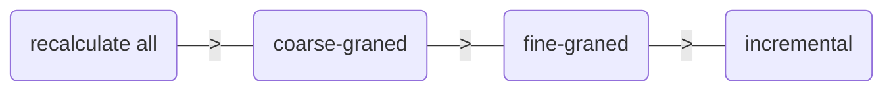
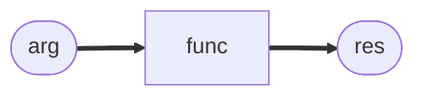
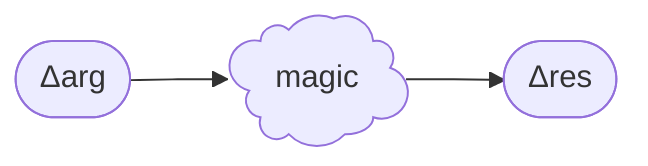
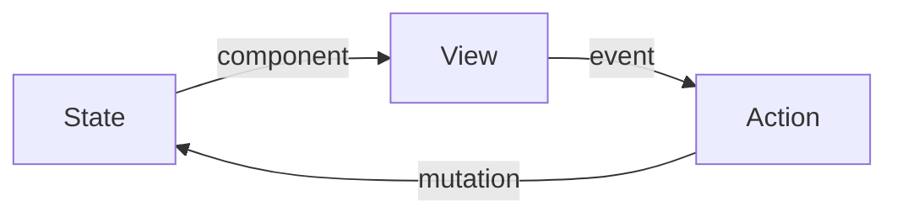
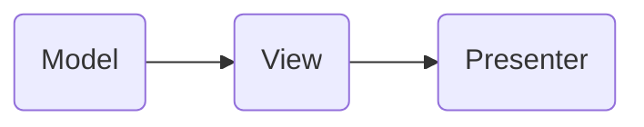
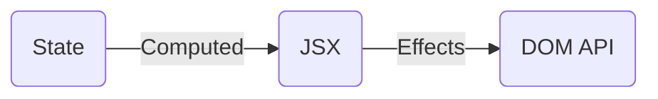

# Инкрементальные вычисления в UI-фреймворках

<!--
Всех приветствую. Как видно из названия, я сейчас буду говорить о фреймворках. И так как мы сейчас на конференции по JavaScript, разговор будет больше про UI в Web-е, хотя многие идеи применимы ко многим платформам, где есть графический интерфейс. Возможно, кто-то уже догадывается, что речь пойдёт про механизмы обновления UI при изменении состояния. И мы будем стремиться, чтобы пересчитывалось всё инкрементально - только то, что реально изменилось.
-->
---
level: 1
hideInToc: true
---

# Приятно познакомиться

<div class="grid grid-cols-2 gap-4 items-center">
  <div class="flex gap-x-1 text-xl items-center"><div><b>Василий Алфертьев</b></div></div>
  <div>
    
  </div>
  <div>
    <p><logos-telegram style="display: inline; width: 32px; height: 32px" /> <b>Telegram</b>: <a href="https://t.me/alfertev2012">@alfertev2012</a></p>
    <p><logos-github-icon style="display: inline; width: 32px; height: 32px" /> <b>GitHub</b>: <a href="https://github.com/alfertev2014">@alfertev2014</a></p>
  </div>
  <div class="flex gap-3 items-center">
    <logos-react style="display: inline; width: 64px; height: 64px" /><div>React</div>
    <div></div>
    <logos-typescript-icon style="display: inline; width: 64px; height: 64px" /><div>TypeScript</div>
  </div>
</div>

<!--
Теперь немного обо мне. Я Василий Алфертьев, в настоящее время - frontend-разработчик в компании Открытые решения, пишу в основном на React-е, обязательно с TypeScript-ом, люблю придерживаться строгой типизации и вообще люблю, когда абстракции строгие.
-->
---
level: 2
hideInToc: true
---

# Чем ещё владею

<style>
li {
  margin-block: 0;
  line-height: 1.5rem;
}
</style>
<div class="grid grid-cols-2 gap-4">

<div>

- 5+ лет в **С++**:
  - системное программирование
  - Linux
  - UI на Qt

</div>
<div v-click="1">

- Увлекаюсь
  - дизайном языков программирования
  - best practices и архитектурой ПО
  - computer science

</div>
<div>

- ~6 лет в **Java**:
  - backend на Spring
  - базы данных
  - монолиты, микросервисы…

</div>
<div v-click="1">

- Тянет разбираться в
  - компиляторах, IDE и инструментах
  - **Устройстве UI-фреймворков и библиотек**

</div>
</div>

<!--
Начинал интересоваться устройством UI-фреймворков ещё в C# во времена WinForms, много писал UI на Qt. Параллельно много погружался в различные интересные темы computer science, связанные с компиляторами. И с развитием Web-технологий UI-фреймворки для меня не менее интересны.
-->
---
level: 1
layout: center
---

# 🚀 Реактивность

<v-click>Автоматическое обновление производных данных как "реакция" на изменение первичных данных</v-click>

<!--
Сразу прямо скажу, что весь доклад будет вокруг реактивности - про то, как UI *реагирует* на изменения данных состояния приложения. Тема реактивности мне давно интересна. Но она достаточно широкая, и каждый может понимать под реактивностью что-то своё. Я бы даже сказал, что существуют разные виды реактивности, сильно отличающиеся друг от друга, но отдельного удачного термина под каждую реактивность не нашлось.

1. В самом общем приближении под реактиновстью можно считать автоматическое обновление одних данных в ответ на изменение других данных.
-->
---
level: 2
---

# Разновидности реактивности

<style>
li {
  margin-block: 0;
  line-height: 1.2rem;
}
</style>
<div class="grid grid-cols-2 gap-4">
<div class="card" v-click>
<div class="card-header">Ориентированные на данные</div>

- первичные и производные данные
- граф зависимостей

<div>Примеры: <logos-mobx/> MobX, <logos-vue/> Vue, <logos-solidjs-icon/> Solid</div>
</div>
<div class="card" v-click>
<div class="card-header">Ориентированные на события</div>

- события и потоки данных
- observables и observers
- трансформация, фильтрация, буферизация событий и т.п.

<div>Примеры: <logos-reactivex/> Rx.js</div>
</div>
<div class="card" v-click>
<div class="card-header">Гибрид первых двух</div>

- подробный граф из событий, данных и действий с ними

<div>Примеры: <logos-effector/> Effector</div>
</div>
<div class="card" v-click>
<div class="card-header">Основанные на перевычислении</div>

- rerender частей приложения
- reconcilliation результатов

<div>Примеры: <logos-react/> React</div>
</div>
</div>


<!--
А если пуститься в детали, то можно выделить, например,

1. реактивность, которая строится вокруг данных и построения графа зависимостей между ними. И я лично для себя реактивность представляю именно так. Примером реализации такой реактивности может служить сигнальная реактивность.

2. Бывает другое популярное представление о реактивности - это потоки данных и других произвольных событий. В этом случае тоже выстраивается граф, но не узлов, в которых хранятся данные, а узлами являются обработчики протекающих по ним данных. Примером библиотеки, которая сразу здесь вспоминается, это Rx.js. Для меня это уже не совсем та реактивность, о которой я себе представляю. И в докладе мы такой тип реактивности рассматривать не будем.

3. Где-то посередине между этими двумя типами реактивности можно расположить Effector, в котором формируется подробный граф, где узлами являются и хранилища данных, и события, и действия по их обработке. Это уже нечно большее, чем просто реактивность, так как этот граф рассчитан на описание всей бизнес-логики приложения и содержит и императивные операции.

4. И вот сейчас может быть неожиданно. React тоже реактивен. Хотя когда-то говорили, что React не реактивен, хоть и называется React-ом. Он по своему реактивен, как мы далее увидим, когда поговорим про "гранулярность" реактивности.
-->
---
level: 2
---

<style>
  .slidev-code-wrapper {
    --slidev-code-font-size: 20px;
    --slidev-code-line-height: 1.5em;
  }
</style>

# Как я представляю реактивность?

````md magic-move
```ts{all|1}
let U = 5

let R = 1

const I = U / R  // --> 5

const P = I * U  // --> 25
```
```ts{1|all}
let U = 4

let R = 1

const I = U / R  // --> ?

const P = I * U  // --> ?
```
```ts{5}
let U = 4

let R = 1

const I = U / R  // --> 4

const P = I * U  // --> ?
```
```ts{7|3}
let U = 4

let R = 1

const I = U / R  // --> 4

const P = I * U  // --> 16
```
```ts
let U = 4

let R = 0.5

const I = U / R  // --> 8

const P = I * U  // --> 32
```
```ts
let U = 1.5

let R = 2

const I = U / R  // --> 0.75

const P = I * U  // --> 1.125
```
````

<!--
Что я себе всегда представляю под реактивностью? Как я уже сказал, для меня реактивность больше строится вокруг данных. А взаимосвязи между данными описываются уравнениями. Конечно, уравнения не должны противоречить друг другу. Для каждого значения можно из выражения формулы определить, от каких значений оно зависит. Если составить граф из этих значений, то это должен быть ориентированный ациклический граф. При изменении исходных данных должны пересчитаться все зависимые от них данные, и затем зависимые зависимых. Вся эта последовательность вычислений должна произойти за один проход таким образом, чтобы потребитель конечных данных не увидел их в состоянии промежуточных вычислений.

Напоминает поведение Excel-таблички. И именно Excel обычно приводят в пример, когда пытаются объяснить реактивность.
-->
---
level: 3
---

```tsx{all|2-5|9,12,15,16|10,13}
const OhmsLaw = () => {
  let voltage = 1.5   // U
  let resistance = 2  // R

  const amperage = voltage / resistance // I

  return (
    <div>
      <p>Напряжение: <input type="number" value={voltage} onInput={e => {
        voltage = e.target.valueAsNumber
      }}/></p>
      <p>Сопротивление: <input type="number" value={resistance} onInput={e => {
        resistance = e.target.valueAsNumber
      }}/></p>
      <p>Сила тока: <span>{amperage}</span> А</p>
      <p>Мощность: <span>{amperage * voltage}</span> Вт</p>
    </div>
  )
}
```

<!--
И я бы ожидал от UI-фреймворка примерно следующего. Хочется, чтобы связи между данными описывались простыми формулами, UI описывался простой структурой с привязкой данных, события вызывали бы изменения исходных данных. А в ответ на изменения происходил бы не ререндер целого компонента, а точечно изменялось бы в UI ровно то, что нужно, и промежуточные вычисления выполнялись бы минимальные.

Иными словами, хочется, чтобы код был лаконичный и понятный, как обычный JavaScript, но выполнялся бы с семантикой "fine-grained reactivity".
-->
---
level: 2
---

# В JavaScript нет реактивности

<div class="grid grid-cols-2 gap-4">
<div class="card" v-click>
<div class="card-header">Runtime</div>

- Библиотеки реактивности
- Интеграция с фреймворками

</div>
<div class="card" v-click>
<div class="card-header">Build time</div>

- Расширение языка, трансформации кода
- +1 шаг сборки

</div>
</div>

<!--
Но проблема в том, что в JavaScript нет такой реактивности даже близко. И язык не располагает возможностями, чтобы сделать это в том виде, как я сейчас описал. Поэтому приходится идти на компромисс: делать либо специальные библиотеки, либо модифицировать язык или придумывать новый язык с семантикой реактивности.
-->
---
level: 2
---

# "Гранулярность" реактивности

<div class="text-center">



<v-click>

Идеал: минимально необходимые обновления - **инкрементальные вычисления**.

</v-click>
</div>


<!--
Под гранулярностью понимается, насколько мелкие блоки из действий по пересчёту производных данных могут выполняться атомарно и независимо.

Ведь можно по любому мелкому изменению исходных данных пересчитывать вообще всё. Это дорого, хотя где-то такой подход выигрывает. В видео-играх, например, при отрисовке каждого кадра.

Бывают реализации, допускающие некоторые лишние действия, выполняемые зря, потому что исходная причина реакции не влияет на их результат. А всё потому, что реакции организованы в довольно большие группы действий - крупные гранулы - и мы вынуждены выполнять их целиком. Отсюда и название "coarse-graned reactivity".

Есть более умные реализации, старающиеся минимизировать лишние действия. Для этого все действия реакций разбиваются на более мелкие операции, как мелкие гранулы, поэтому распространился термин "fine-graned reactivity".

В идеале, конечно, хотелось бы избежать лишних действий вообще, выполнить ровно то, что нужно для обновления производных данных, инкрементально. Но такой подход имеет свою цену. При экономии на лишних действиях мы много потеряем на организацию точности всего этого процесса.
-->
---
level: 3
---

<style>
  .slidev-code-wrapper {
    --slidev-code-font-size: 12px;
    --slidev-code-line-height: 1em;
  }
</style>

# "Coarse-grained reactivity" (React)

````md magic-move
```tsx
const OhmsLaw = () => {
  const [voltage, setVoltage] = useState(1.5)
  const [resistance, setResistance] = useState(2)

  const amperage = voltage / resistance

  return (
    <div>
      <p>Напряжение: <input type="number" value={voltage} onInput={e => {
        setVoltage(e.target.valueAsNumber)
      }}/></p>
      <p>Сопротивление: <input type="number" value={resistance} onInput={e => {
        setResistance(e.target.valueAsNumber)
      }}/></p>
      <p>Сила тока: <span>{amperage}</span> А</p>
      <p>Мощность: <span>{amperage * voltage}</span> Вт</p>
    </div>
  )
}
```
```tsx
const OhmsLaw = () => {
  const [voltage, setVoltage] = useState(1.5)
  const [resistance, setResistance] = useState(2)

  const amperage = useMemo(() => voltage / resistance, [voltage, resistance])
  const power = useMemo(() => amperage * voltage, [amperage, voltage])

  return (
    <div>
      <p>Напряжение: <input type="number" value={voltage} onInput={e => {
        setVoltage(e.target.valueAsNumber)
      }}/></p>
      <p>Сопротивление: <input type="number" value={resistance} onInput={e => {
        setResistance(e.target.valueAsNumber)
      }}/></p>
      <p>Сила тока: <span>{amperage}</span> А</p>
      <p>Мощность: <span>{power}</span> Вт</p>
    </div>
  )
}
```
```tsx{8,20-25}
const OhmsLaw = () => {
  const [voltage, setVoltage] = useState(1.5)
  const [resistance, setResistance] = useState(2)

  const amperage = useMemo(() => voltage / resistance, [voltage, resistance])
  const power = useMemo(() => amperage * voltage, [amperage, voltage])

  const [currentDirection, setCurrentDirection] = useState<"AC" | "DC">("DC")

  return (
    <div>
      <p>Напряжение: <input type="number" value={voltage} onInput={e => {
        setVoltage(e.target.valueAsNumber)
      }}/></p>
      <p>Сопротивление: <input type="number" value={resistance} onInput={e => {
        setResistance(e.target.valueAsNumber)
      }}/></p>
      <p>Сила тока: <span>{amperage}</span> А</p>
      <p>Мощность: <span>{power}</span> Вт</p>
      <p>Направленность:{" "}
        <select value={currentDirection}>
          <option>AC</option>
          <option>DC</option>
        </select>
      </p>
    </div>
  )
}
```
````

---
level: 3
---

# "Coarse-grained reactivity" (React)

<div class="grid grid-cols-2 gap-4">
<div class="card" v-click>
<div class="card-header">Преимущества</div>

- Это всё ещё JavaScript, который вы знаете
- Просто библиотека, легко интегрировать
- Удобный "синтаксис": деструктуризация props, условный рендеринг, рендеринг массивов

</div>
<div class="card" v-click>
<div class="card-header">Недостатки</div>

- Лишние перевычисления
- "Правила хуков"
- Дополнительный "синтаксис" хуков
- Явное перечисление зависимостей useMemo
- "Магия" порядка исполнения вычислений

</div>
</div>

---
level: 2
---

# Сигнальная реактивность

```ts
type Signal<T> = {
  get: () => T
  set: (value: T) => void
}

type Computed<T> = {
  get: () => T
}

const signal = <T>(initValue: T): Signal<T> => { /* ... */ }
const computed = <T>(func: () => T): Computed<T> => { /* ... */ }
```

---
level: 3
---

# Сигнальная реактивность

```ts{all|1-2|4-5|7-8|10|12-13}
const voltage = signal(5)
const resistance = signal(1)

const amperage = computed(() => voltage.get() / resistance.get())
const power = computed(() => amperage.get() * voltage.get())

console.log("amperage", amperage.get())  // --> 5
console.log("power", power.get())  // --> 25

voltage.set(4)

console.log("amperage", amperage.get())  // --> 4
console.log("power", power.get())  // --> 16
```

<!--
Одной из самых удачных библиотечных реализаций реализаций, набравшей популярность и принятной многими фреймворками, является так называемая сигнальная реактивность. Данные делятся на изменяемые первичные данные (которые здесь создаются в условном API функцией signal) и производные данные (computed), которые вычисляются выражением на основе первичных данных. Производные данные зависят от других первичных и произвоных данных. Поэтому все узлы данных объединяются в направленный ациклический граф, связывающий из отношением зависимости. Сигнал напоминает паттерн Observable. Но вместо того, чтобы сразу вызывать коллбэк по изменению данных, сначала происходит распространение уведомления тем узлам, которые необходимо пересчитать, а сами вычисления выполняются в правильном порядке в отдельной фазе, чтобы каждый computed вычислялся только с актуальными версиями своих зависимостей.
-->
---
level: 3
---

# Сигнальная реактивность

<v-clicks>

- "Fine-grained reactivity"
- Автоматическое отслеживание зависимостей computed
- Автоматическое обновление зависимостей computed
- Вычисление computed в правильном порядке и только с актуальными данными
- Минимизация лишних вычислений computed, если зависимости не изменились
- Автоматический "clean up" связей при удалении узлов графа

</v-clicks>

---
level: 3
---

# Сигнальная реактивность

<div class="grid grid-cols-2 gap-4">
<div class="card" v-click>
<div class="card-header">Преимущества</div>

- Это всё ещё JavaScript, который вы знаете
- Просто библиотека, легко интегрировать
- Простые соглашения, понятные ограничения

</div>
<div class="card" v-click>
<div class="card-header">Недостатки</div>

- "Магия" порядка исполнения вычислений
- Дополнительный "синтаксис": создание сигналов и computed, получение и изменение значений
- Возможность "потерять реактивность"

</div>
</div>

---
level: 3
---

# computed внутри computed?

````md magic-move
```ts
const a = signal(1)
const b = signal(2)
const c = signal(3)

const foo = computed(() => a.get() + b.get() + c.get())
```
```ts{5}
const a = signal(1)
const b = signal(2)
const c = signal(3)

const foo = computed(() => a.get() + computed(() => b.get() + c.get()))
```
```ts{5-6}
const a = signal(1)
const b = signal(2)
const c = signal(3)

const bar = computed(() => b.get() + c.get())
const foo = computed(() => a.get() + bar.get())
```
````

---
level: 3
---

# Потеря реактивности сигналов

````md magic-move
```ts
const a = signal("The Answer")
const b = signal(6)
const c = signal(7)

const d = computed(() => `${a.get()} is ${b.get() * c.get()}`)
```
```ts
const a = signal("The Answer")
const b = signal(6)
const c = signal(7)

const fourtyTwo = b.get() * c.get() // 42

const d = computed(() => `${a.get()} is ${fourtyTwo}`)
```
```ts
const a = signal("The Answer")
const b = signal(6)
const c = signal(7)

const fourtyTwo = b.get() * c.get() // 42

const d = computed(() => `${a.get()} is ${fourtyTwo}`)

b.set(12)

console.log(d.get()) // "The Answer is 42"
```
```ts{5,11}
const a = signal("The Answer")
const b = signal(6)
const c = signal(7)

const fourtyTwo = computed(() => b.get() * c.get()) // 42

const d = computed(() => `${a.get()} is ${fourtyTwo}`)

b.set(12)

console.log(d.get()) // "The Answer is 84"
```
````
---
level: 3
---

# Proxy-объекты

```ts
const reactive = <T extends Record<string, unknown>>(o: T): T => {
  const res = {}
  for (const [key, value] of Object.entries(o)) {
    const s = signal(value)
    Object.defineProperty(res, key, {
      get() { return s.get() }
      set(newValue) { s.set(newValue) }
    })
  }
  return res
}

```
---
level: 3
---

# Потеря реактивности сигналов: деструктуризация

````md magic-move
```ts{all|1|2-3|5|7-8|10|12-13|5}
const foo = reactive({ a: "The Answer", b: 42 })
const bar = computed(() => `${foo.a} is ${foo.b}`)
console.log(bar.get()) // "The Answer is 42"

const { a, b } = foo

const baz = computed(() => `${a} is ${b}`)
console.log(baz.get()) // "The Answer is 42"

foo.b = 100500

console.log(bar.get()) // "The Answer is 100500"
console.log(baz.get()) // "The Answer is 42"
```
```ts{5-6}
const foo = reactive({ a: "The Answer", b: 42 })
const bar = computed(() => `${foo.a} is ${foo.b}`)
console.log(bar.get()) // "The Answer is 42"

const a = foo.a
const b = foo.b

const baz = computed(() => `${a} is ${b}`)
console.log(baz.get()) // "The Answer is 42"

foo.b = 100500

console.log(bar.get()) // "The Answer is 100500"
console.log(baz.get()) // "The Answer is 42"
```
```ts{5-6,8|all|14}
const foo = reactive({ a: "The Answer", b: 42 })
const bar = computed(() => `${foo.a} is ${foo.b}`)
console.log(bar.get()) // "The Answer is 42"

const a = computed(() => foo.a)
const b = computed(() => foo.b)

const baz = computed(() => `${a.get()} is ${b.get()}`)
console.log(baz.get()) // "The Answer is 42"

foo.b = 100500

console.log(bar.get()) // "The Answer is 100500"
console.log(baz.get()) // "The Answer is 100500"
```
````

---
level: 2
layout: center
---

# Компилируемая реактивность?

<v-clicks>

- Преобразования кода для удобства использования сигналов
- Всё тот же JavaScript, который вы знаете?

</v-clicks>

<!--
И многие фреймворки держатся за идею оставаться в рамках всем знакомого JavaScript. Хотя на самом деле применяют к нему преобразования при сборке.
-->
---
level: 2
---

# Vue.js

```html{all|6,10|6,8}
<script setup lang="ts">
interface Props {
  msg?: string
  labels?: string[]
}
const { msg = 'hello', labels = ['one', 'two'] } = defineProps<Props>()

watchEffect(() => { console.log(msg) })

const emit = defineEmits<{
  (e: 'change', id: number): void
  (e: 'update', value: string): void
}>()
</script>
```

<!--

-->
---
level: 2
---

# Svelte

```html{all|2-5|2|4-5|6}
<script>
  let { answer = 42 } = $props();
	let count = $state(1);
	let doubled = $derived(count * 2);
	let quadrupled = $derived(doubled * 2);
	function handleClick() { count += 1; }
</script>

<p>The answer is {answer}</p>
<button onclick={handleClick}>Count: {count}</button>
<p>{count} * 2 = {doubled}</p>
<p>{doubled} * 2 = {quadrupled}</p>
```

---
level: 2
---

# Solid.js

```js{all|1-2}
function MyComponent(props) {
  const finalProps = mergeProps({ defaultName: "Ryan Carniato" }, props);
  const [count, setCount] = createSignal(1);
  const increment = () => setCount(count => count + 1);
  const doubled = createMemo(() => count() * 2);
  const quadrupled = createMemo(() => doubled() * 2);
  return (
    <div>
      <div>Hello {finalProps.defaultName}</div>
      <button type="button" onClick={increment}>Count: {count()}</button>
      <p>{count()} * 2 = {doubled()}</p>
      <p>{doubled()} * 2 = {quadrupled()}</p>
    </div>
  );
}
```
---
level: 2
---

# Что смущает?

<div>

Фреймворки пытаются преодолеть:
- ограничения JavaScript для реализации реактивности
- неудобства API реализации реактивности

Смешиваются:
- обычный JavaScript
- API runtime-реализации реактивности
- "Магия" преобразований кода

</div>

---
level: 2
---

```tsx{all|1|2|3-4|6-16|9-13|8}
const MyComponent = ({ answer = 42 }) => {
	let count = 1;
	const doubled = count * 2;
	const quadrupled = doubled * 2;
  return (
    <>
      <p>The Answer is {answer}</p>
      <button onСlick={() => { count += 1 }}>Count: {count}</button>
      <p>{count === answer ? (
        <span class="equals">Count === The Answer</span>
      ) : (
        <span class="not-equals">Count !== The Answer</span>
      )}</p>
      <p>{count} * 2 = {doubled}</p>
      <p>{doubled} * 2 = {quadrupled}</p>
    </>
  )
}
```

---
level: 2
---

# Инкрементальные вычисления

<div class="text-center">



<div v-click>



</div>
</div>
<v-clicks>

- Чистая функция - декларация связей и потоков данных
- Инкрементальное обновление может взять на себя фреймворк

</v-clicks>

<!--
Основная идея инкрементальных вычислений заключается вот в чём. Есть у нас чистая функция, преобразующая некоторый аргумент в результат без побочных эффектов. Представьте, что тут аргумент может быть большой и сложный, например, целое дерево данных. Функция тоже может быть композицией других функций. И результат тоже может быть большим и сложным.

И если мы внесём небольшие изменения в аргумент, то вместо того, чтобы делать полный перезапуск вычисления всей функции, мы хотели бы сделать такие минимальные действия, основанные на коде этой функции, чтобы точечно изменить результат, оставшийся от предыдущих вычислений.
-->
---
level: 2
---

# 📜 Декларативное программирование

<v-clicks>

- Код описывает ожидаемый результат, а не способ его получения
  - Код описывает структуру UI, потоки данных, логику приложения в виде **деклараций**, а не последовательности действий
- Domain Specific Language (DSL) поверх универсального JavaScript
- Строгие абстракции:
  - Программист сосредоточен на семантике DSL
  - Детали реализации берёт на себя фреймворк

</v-clicks>

---
level: 1
layout: cover
---

# UI-фреймворки и ментальная модель UI

<!--
Вот я всё говорю тут: "фреймворки, фреймворки...". Давайте сначала определимся, что собираемся рассматривать - что мы будем понимать под UI-фреймворками и чего мы от них хотим.
-->
---
level: 2
---

# Чего мы хотим от UI-фреймворка?

- Повышение продуктивности при разработке UI:
  - Улучшение Developer Experience в понятной парадигме
  - Автоматически оптимизированный результат на выходе

<!--
Итак, чего же мы хотим от UI-фреймворка, как и от любого другого инструмента или решения?

1. Это, конечно же, повышение нашей продуктивности по сравнению с разработкой без фреймворка. И обычно есть два аспекта: 
2. Мы хотим, чтобы код можно было писать удобно и понятно для нас - в понятной парадигме. Это так называемый Developer Experience.
3. И в то же время мы хотим, чтобы этот код не тормозил, не съедал много памяти - и всё это было волшебным образом само собой, автоматически.

Фреймворк должен снимать с нас большую часть забот, повторяющихся из проекта в проект, чтобы мы сосредоточили своё внимание на том, что по настоящему *специфично* для проекта. Иными словами, мы хотим оставаться в той абстракции, которая нам интересна, а фреймворк должен быть инструментом обеспечения её корректной реализации, скрывая от нас низкоуровневые детали.
-->
---
level: 2
---

# Все фреймворки похожи друг на друга

<v-clicks>

- Ментальная модель UI
- **Инкрементальное** обновление view при изменении state
- Реактивность как реализация

</v-clicks>

<!--
Эта идея всё больше прослеживается в UI.

У всех фреймворков в последнее время стало много общего, они всё больше становятся похожи друг на друга.

1. И всё это потому, что они стараются моделировать одну и ту же *абстракцию* пользовательского интерфейса. И отличаются они только *способами* и *строгостью* реализации этой абстракции. И именно от понимания этой абстракции и механизмов её реализации *исходят* все *паттерны* использования фреймворка и *best practices*.
2. И уже в этой абстрактной модели можно отметить фазу инкрементального обновления представления. В модели UI очень удобно представлять view как чистую функцию от state. И именно про инкрементальные вычисления *этой* функции мы и будем говорить.
3. Во многие фреймворки уже пробралась идея сигнальной реактивности как реализации инкрементальных вычислений. Есть даже proposal для добавления сигналов прямо в JavaScript runtime. Но об этом позже.
-->
---
level: 3
---

# Ментальная модель UI



- UI разделяется на дерево компонентов с жизненным циклом
- Состояние, изменяемое во времени
- Представление, производное от состояния (чистая функция)
- Пользовательские действия и фоновые события
- Действия над состоянием

<!--
Быстро вспомним, как мы себе представляем UI. Примерно так же себе представляет его и пользователь.

1. Это некоторая иерархическая структура из элементов (компонентов), которые могут появляться и исчезать, то есть, обладают жизненным циклом.
2. Некоторые компоненты могут иметь состояние, изменяемое во времени, привязанное к жизненному циклу компонентов.
3. То, что видит пользователь - это представление, которое рисуется на основе данных, производных от состояния. И это отображение можно определить чистой функцией.
4. У представления есть средства для выполнения пользовательских действий - кликов, жестов, нажатий клавиш.
5. Также, в приложении могут происходить другие фоновые события, например, таймеры или завершение загрузки данных с сервера. Они выступают триггерами для
6. модификации состояния UI - простые транзакции по изменению данных, описывающие новое состояние на основе предыдущего (тоже чисто функционально).
-->

---
level: 3
layout: center
class: text-center
---

Большая часть UI укладывается в эту модель.

Исключения из правил фреймворка можно (нужно!) держать в коде отдельно.

<!--
Большая часть UI укладывается в эту модель. В любом типовом UI будут компоненты, цикл обновления представления и потоки данных, описываемые чистыми функциями. В этом и состоит идея фреймворка - упросить нам работу с этой большей частью UI и сделать это наиболее оптимально.

А все нестандартные компоненты, такие как canvas, карты, плееры, или директивы, интеграции и другие специальные возможности, требующие доступа к низкоуровневым API нужно держать в кодовой базе отдельно. Они выступают адаптерами возможностей для фреймворка, своего рода расширениями языка.
-->
---
level: 3
---

# MVP

<div class="text-center">





</div>

---
level: 3
---

# Привязка ко времени

- Развитие UI во времени синхронизируется с "тиками" некоторого планировщика (event loop)
- Изменения состояния группируются в "транзакции", каждая соответствует некоторому "тику"
- Обновление представления с новым состоянием в пределах одного "тика"
- Асинхронные операции могут растягиваться на много "тиков", обновления представления могут накладываться во времени (не рассматриваем в докладе)

<!--
В реализации любого UI всегда присутствует некоторый планировщик, наподобие event loop. Хотя есть и новый API scheduler, и requestAnimationFrame, и некоторые фреймворки могут иметь свою реализацию очередей с приоритетами.
Существуют условные "тики" - моменты времени, в которые представление должно быть актуально. Любые операции между тиками должны приводить к актуальному UI. А актуальный UI - это когда представление в точности соответствует состоянию по правилам отображения.

Как бы ни хайповало функциональное программирование с иммутабельностью в свои годы, а UI - это всё-таки живая система с изменяемым состоянием, развивающимся во времени.

-->
---
level: 3
---

# Не рассматриваем

- Запросы на сервер
- Асинхронные операции
- Анимации и transitions
- SSR
- Специфические оптимизации работы с DOM

---
level: 1
layout: center
---

# Инкрементальные вычисления

---
level: 2
layout: center
---

```ts
let a = 40
let b = 2

const c = a + b
```

---
level: 2
layout: center
---

````md magic-move
```ts
let a = "The "
let b = "Answer"

const c = a + b
```
```ts
let a = "The Answer"
let b = "Life and Universe and Everything"

const c = `${a} to ${b}`
```
````

---
level: 2
---

````md magic-move
```ts{all|1-12|14-16}
const f = (a: string, b: number) => {
  const c = a.toUppercase()
  const d = g(b * 2, 42)
  const e = g(100500, b * 3)
  return `${c} ${d} ${e}`
}

const g = (p: number, q: number) => {
  const pp = p * p
  const qq = Math.sqrt(q)
  return pp + qq
}

let a = "The Answer"
let b = 42
f(a, b)
```
```ts{1,16}
const f = (a: string, b: number) => {  // a = "The Answer", b = 42
  const c = a.toUppercase()
  const d = g(b * 2, 42)
  const e = g(100500, b * 3)
  return `${c} ${d} ${e}`
}

const g = (p: number, q: number) => {
  const pp = p * p
  const qq = Math.sqrt(q)
  return pp + qq
}

let a = "The Answer"
let b = 42
f(a, b)
```
```ts{2}
const f = (a: string, b: number) => {  // a = "The Answer", b = 42
  const c = a.toUppercase()  // c = "THE ANSWER"
  const d = g(b * 2, 42)
  const e = g(100500, b * 3)
  return `${c} ${d} ${e}`
}

const g = (p: number, q: number) => {
  const pp = p * p
  const qq = Math.sqrt(q)
  return pp + qq
}

let a = "The Answer"
let b = 42
f(a, b)
```
```ts{3-4|3-4,8-12}
const f = (a: string, b: number) => {  // a = "The Answer", b = 42
  const c = a.toUppercase()  // c = "THE ANSWER"
  const d = g(b * 2, 42)  // g(84, 42) = ?
  const e = g(100500, b * 3)  // g(100500, 126) = ?
  return `${c} ${d} ${e}`
}

const g = (p: number, q: number) => {
  const pp = p * p
  const qq = Math.sqrt(q)
  return pp + qq
}

let a = "The Answer"
let b = 42
f(a, b)
```
```ts{3|8-12}
const f = (a: string, b: number) => {  // a = "The Answer", b = 42
  const c = a.toUppercase()  // c = "THE ANSWER"
  const d = g(b * 2, 42)  // g(84, 42) = 7062.480740698408
  const e = g(100500, b * 3)  // g(100500, 126) = ?
  return `${c} ${d} ${e}`
}

const g = (p: number, q: number) => {  // p = 84, p = 42
  const pp = p * p  // pp = 7056
  const qq = Math.sqrt(q)  // q = 6.48074069840786
  return pp + qq  // 7062.480740698408
}

let a = "The Answer"
let b = 42
f(a, b)
```
```ts{4|8-12}
const f = (a: string, b: number) => {  // a = "The Answer", b = 42
  const c = a.toUppercase()  // c = "THE ANSWER"
  const d = g(b * 2, 42)  // g(84, 42) = 7062.480740698408
  const e = g(100500, b * 3)  // g(100500, 126) = 10100250011.224972
  return `${c} ${d} ${e}`
}

const g = (p: number, q: number) => {  // p = 100500, p = 126
  const pp = p * p  // pp = 10100250000
  const qq = Math.sqrt(q)  // q = 11.224972160321824
  return pp + qq  // 10100250011.224972
}

let a = "The Answer"
let b = 42
f(a, b)
```
```ts{5}
const f = (a: string, b: number) => {  // a = "The Answer", b = 42
  const c = a.toUppercase()  // c = "THE ANSWER"
  const d = g(b * 2, 42)  // g(84, 42) = 7062.480740698408
  const e = g(100500, b * 3)  // g(100500, 126) = 10100250011.224972
  return `${c} ${d} ${e}`  // "THE ANSWER 7062.480740698408 10100250011.224972"
}

const g = (p: number, q: number) => {
  const pp = p * p
  const qq = Math.sqrt(q)
  return pp + qq
}

let a = "The Answer"
let b = 42
f(a, b)
```
```ts{14}
const f = (a: string, b: number) => {  // a = "The Answer", b = 42
  const c = a.toUppercase()  // c = "THE ANSWER"
  const d = g(b * 2, 42)  // g(84, 42) = 7062.480740698408
  const e = g(100500, b * 3)  // g(100500, 126) = 10100250011.224972
  return `${c} ${d} ${e}`  // "THE ANSWER 7062.480740698408 10100250011.224972"
}

const g = (p: number, q: number) => {
  const pp = p * p
  const qq = Math.sqrt(q)
  return pp + qq
}

let a = "Any questions?"
let b = 42
f(a, b)
```
```ts{14,1,2,5}
const f = (a: string, b: number) => {  // a = "Any questions?", b = 42
  const c = a.toUppercase()  // c = "ANY QUESTIONS?"
  const d = g(b * 2, 42)  // g(84, 42) = 7062.480740698408
  const e = g(100500, b * 3)  // g(100500, 126) = 10100250011.224972
  return `${c} ${d} ${e}`  // "ANY QUESTIONS? 7062.480740698408 10100250011.224972"
}

const g = (p: number, q: number) => {
  const pp = p * p
  const qq = Math.sqrt(q)
  return pp + qq
}

let a = "Any questions?"
let b = 42
f(a, b)
```
```ts{15}
const f = (a: string, b: number) => {  // a = "Any questions?", b = 42
  const c = a.toUppercase()  // c = "ANY QUESTIONS?"
  const d = g(b * 2, 42)  // g(84, 42) = 7062.480740698408
  const e = g(100500, b * 3)  // g(100500, 126) = 10100250011.224972
  return `${c} ${d} ${e}`  // "ANY QUESTIONS? 7062.480740698408 10100250011.224972"
}

const g = (p: number, q: number) => {
  const pp = p * p
  const qq = Math.sqrt(q)
  return pp + qq
}

let a = "Any questions?"
let b = 43
f(a, b)
```
```ts{15}
const f = (a: string, b: number) => {  // a = "Any questions?", b = 43
  const c = a.toUppercase()  // c = "ANY QUESTIONS?"
  const d = g(b * 2, 42)  // g(86, 42) = 7062.480740698408
  const e = g(100500, b * 3)  // g(100500, 129) = 10100250011.224972
  return `${c} ${d} ${e}`  // "ANY QUESTIONS? 7062.480740698408 10100250011.224972"
}

const g = (p: number, q: number) => {
  const pp = p * p
  const qq = Math.sqrt(q)
  return pp + qq
}

let a = "Any questions?"
let b = 43
f(a, b)
```
````

---
level: 2
---

```ts
let a = 100500.0
let b = "Whatever"

const c = { foo: a, bar: b }
```

---
level: 3
---

# Identity объектов и value types

TBD

---
level: 3
---

# Вложенная реактивность

TBD

- Реактивные массивы и их трансформация
- Реактивные объекты с фиксированной структурой
- Union-типы полей объектов
- Вложенные объекты и вложенные массивы
- Только деревья, нет циклов в данных
- ссылка на изменяемые данные - то, чего нет в JavaScript

---
level: 3
---

# Вложенная реактивность: пример

TBD

---
level: 3
---

# Ограничения декларативного языка

TBD

- Запрещён лишний синтаксис: class, this, new и т.п. (ESLint конфиг)
- Ограниченный API: нет прямого доступа к Web APIs, не всё можно import-ить
- Специальный API для реактивных массивов
- Чистота функций: отсутствие циклов
- Изменения данных - только в специальных контекстах (например, обработчики событий)
- Взаимодействие с обычным кодом - через "границу"

При этом это всё ещё подмножество TypeScript

---
level: 1
---

# Proof of concept

TBD

- AST для DSL
- Исходники могут быть, например, TypeScript+JSX
- реализация сигнальной реактивности
- Компилятор DSL в графы сигнальной реактивности
- Оптимизации на основе статической информации о потоках данных

Показать TodoMVC

---
level: 1
---

# Заключение

- Большая часть UI описывается декларативно
- Ментальная модель UI: состояние --> представление --> события
- Реактивность в UI: автоматическое обновление представления при изменении состояния
- Сигнальная реактивность: состояние --> представление - граф зависимостей данных 
- Инкрементальные вычисления: состояние --> представление - чистая функция, вычисляемая инкрементально
- Декларативный компилируемый DSL требует выполнения ограничений и соглашений
- Абстракции, отличные от JavaScript: value types

---
level: 1
---

# Выводы

- UI-фреймворки имеют неудобства в реализации и использовании реактивности
- UI-фреймворки похожи друг на друга: ориентированы на одну ментальную модель UI
- Более декларативный подход имеет свои преимущества в DX
- Отделение простого от сложного
- Полезно видеть абстракции и неявные соглашения, даже оставаясь в JavaScript

---
level: 1
layout: center
---

# Спасибо!
