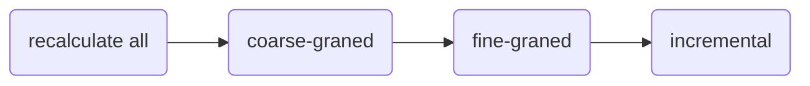
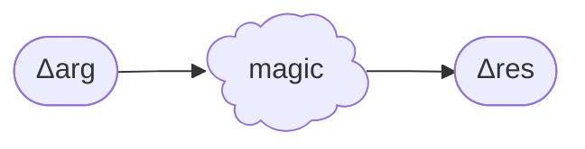
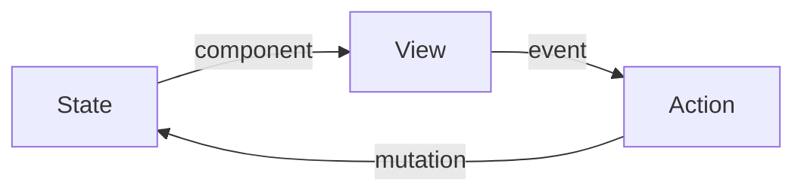

# Инкрементальные вычисления в UI-фреймворках

<!--
Всех приветствую. Как видно из названия, я сейчас буду говорить о фреймворках. И так как мы сейчас на конференции по JavaScript, разговор будет больше про UI в Web-е, хотя многие идеи применимы ко многим платформам, где есть графический интерфейс. Возможно, кто-то уже догадывается, что речь пойдёт про механизмы обновления UI при изменении состояния. И мы будем стремиться, чтобы пересчитывалось всё инкрементально - только то, что реально изменилось.
-->
---
level: 1
hideInToc: true
---

# Приятно познакомиться

<div class="flex gap-x-3">
  <div class="flex gap-x-1 text-xl"><div><b>Василий Алфертьев</b></div></div>
  <div>
    
  </div>
  <div>
    <p><logos-telegram style="display: inline; width: 32px; height: 32px" /> <b>Telegram</b>: <a href="https://t.me/alfertev2012">@alfertev2012</a></p>
    <p><logos-github-icon style="display: inline; width: 32px; height: 32px" /> <b>GitHub</b>: <a href="https://github.com/alfertev2014">@alfertev2014</a></p>
  </div>
  <div>
    <div class="two-cols-grid">
      <div><logos-react style="display: inline; width: 64px; height: 64px" /> React</div>
      <div><logos-typescript-icon style="display: inline; width: 64px; height: 64px" /> TypeScript</div>
    </div>
  </div>
</div>

<!--
Теперь немного обо мне. Я Василий Алфертьев, в настоящее время - frontend-разработчик в компании Открытые решения, пишу в основном на React-е, обязательно с TypeScript-ом, люблю придерживаться строгой типизации и вообще люблю, когда абстракции строгие.
-->
---
level: 2
hideInToc: true
---

# Чем ещё владею

<style>
li {
  margin-block: 0;
  line-height: 1.5rem;
}
</style>
<div class="two-cols-grid">

<div>

- 5+ лет в **С++**:
  - системное программирование
  - Linux
  - UI на Qt

</div>
<div v-click="1">

- Увлекаюсь
  - **дизайном языков программирования**
  - best practices и архитектурой ПО
  - computer science

</div>
<div>

- ~6 лет в **Java**:
  - backend на Spring
  - базы данных
  - монолиты, микросервисы…

</div>
<div v-click="1">

<ul>
<li>Тянет разбираться в
  <ul>
  <li>компиляторах и оптимизациях</li>
  <li>"кишках" runtime разных языков</li>
  <li>IDE и инструментах</li>
  <li>Устройстве UI-фреймворков и библиотек</li>
  </ul>
</li>
</ul>
</div>
</div>

<!--
Начинал интересоваться устройством UI-фреймворков ещё в C# во времена WinForms, много писал UI на Qt. Параллельно много погружался в различные интересные темы computer science, связанные с компиляторами. И с развитием Web-технологий UI-фреймворки для меня не менее интересны.
-->
---
level: 1
layout: center
---

# 🚀 Реактивность

<v-click>Автоматическое перевычисление одних данных как "реакция" на изменение других данных</v-click>

<!--
Сразу прямо скажу, что весь доклад будет вокруг реактивности - про то, как UI *реагирует* на изменения данных состояния приложения. Тема реактивности мне давно интересна. Но она достаточно широкая, и каждый может понимать под реактивностью что-то своё. Я бы даже сказал, что существуют разные виды реактивности, сильно отличающиеся друг от друга, но отдельного удачного термина под каждую реактивность не нашлось.

1. В самом общем приближении под реактиновстью можно считать автоматическое обновление одних данных в ответ на изменение других данных.
-->
---
level: 2
---

# Разновидности реактивности

<v-clicks>

- Ориентированные на данные
  - первичные и производные данные
  - граф зависимостей
  - Примеры: Сигнальная реактивность
- Ориентированные на события
  - события и потоки данных
  - observables, observers, подписки
  - трансформация, фильтрация буферизация событий и т.п.
  - Примеры: Rx.js
- Гибрид первых двух
  - подробный граф из событий, данных и действий с ними
  - Примеры: Effector
- Основанные на перевычислении
  - rerender целых частей приложения
  - reconcilliation результатов
  - Примеры: React

</v-clicks>

<!--
А если пуститься в детали, то можно выделить, например,

1. реактивность, которая строится вокруг данных и построения графа зависимостей между ними. И я лично для себя реактивность представляю именно так. Примером реализации такой реактивности может служить сигнальная реактивность.

2. Бывает другое популярное представление о реактивности - это потоки данных и других произвольных событий. В этом случае тоже выстраивается граф, но не узлов, в которых хранятся данные, а узлами являются обработчики протекающих по ним данных. Примером библиотеки, которая сразу здесь вспоминается, это Rx.js. Для меня это уже не совсем та реактивность, о которой я себе представляю. И в докладе мы такой тип реактивности рассматривать не будем.

3. Где-то посередине между этими двумя типами реактивности можно расположить Effector, в котором формируется подробный граф, где узлами являются и хранилища данных, и события, и действия по их обработке. Это уже нечно большее, чем просто реактивность, так как этот граф рассчитан на описание всей бизнес-логики приложения и содержит и императивные операции.

4. И вот сейчас может быть неожиданно. React тоже реактивен. Хотя когда-то говорили, что React не реактивен, хоть и называется React-ом. Он по своему реактивен, как мы далее увидим, когда поговорим про "гранулярность" реактивности.
-->
---
level: 2
---

# "Гранулярность" реактивности

Насколько большая часть приложения пересчитается в ответ на изменение данных.



<v-click>Идеал: минимально необходимые перевычисления - **инкрементальные вычисления**.</v-click>

<!--
Под гранулярностью понимается, насколько мелкие блоки из действий по пересчёту производных данных могут выполняться атомарно и независимо.

Ведь можно по любому мелкому изменению исходных данных пересчитывать вообще всё. Это дорого, хотя где-то такой подход выигрывает. В видео-играх, например, при отрисовке каждого кадра.

Бывают реализации, допускающие некоторые лишние действия, выполняемые зря, потому что исходная причина реакции не влияет на их результат. А всё потому, что реакции организованы в довольно большие группы действий - крупные гранулы - и мы вынуждены выполнять их целиком. Отсюда и название "coarse-graned reactivity".

Есть более умные реализации, старающиеся минимизировать лишние действия. Для этого все действия реакций разбиваются на более мелкие операции, как мелкие гранулы, поэтому распространился термин "fine-graned reactivity".

В идеале, конечно, хотелось бы избежать лишних действий вообще, выполнить ровно то, что нужно для обновления производных данных, инкрементально. Но такой подход имеет свою цену. При экономии на лишних действиях мы много потеряем на организацию точности всего этого процесса.
-->
---
level: 2
---

# Как я представляю реактивность?

````md magic-move
```ts{all|1}
let U = 5

let R = 1

const I = U / R  // --> 5

const P = I * U  // --> 25
```
```ts{1|all}
let U = 4

let R = 1

const I = U / R  // --> ?

const P = I * U  // --> ?
```
```ts{5}
let U = 4

let R = 1

const I = U / R  // --> 4

const P = I * U  // --> ?
```
```ts{7|3}
let U = 4

let R = 1

const I = U / R  // --> 4

const P = I * U  // --> 16
```
```ts
let U = 4

let R = 0.5

const I = U / R  // --> 8

const P = I * U  // --> 32
```
```ts
let U = 1.5

let R = 2

const I = U / R  // --> 0.75

const P = I * U  // --> 1.125
```
````

<!--
Что я себе всегда представляю под реактивностью? Как я уже сказал, для меня реактивность больше строится вокруг данных. А взаимосвязи между данными описываются уравнениями. Конечно, уравнения не должны противоречить друг другу. Для каждого значения можно из выражения формулы определить, от каких значений оно зависит. Если составить граф из этих значений, то это должен быть ориентированный ациклический граф. При изменении исходных данных должны пересчитаться все зависимые от них данные, и затем зависимые зависимых. Вся эта последовательность вычислений должна произойти за один проход таким образом, чтобы потребитель конечных данных не увидел их в состоянии промежуточных вычислений.

Напоминает поведение Excel-таблички. И именно Excel обычно приводят в пример, когда пытаются объяснить реактивность.
-->
---
level: 3
---

```tsx
const OhmsLaw = () => {
  let voltage = 1.5
  let resistance = 2

  const amperage = voltage / resistance

  return (
    <div>
      <p>Напряжение: <input type="number" value={voltage} onInput={e => { voltage = e.target.valueAsNumber }}/></p>
      <p>Сопротивление: <input type="number" value={voltage} onInput={e => { voltage = e.target.valueAsNumber }}/></p>
      <p>Сила тока: <span>{amperage}</span> А</p>
      <p>Мощность: <span>{amperage * voltage}</span> Вт</p>
    </div>
  )
}
```


<!--
И я бы ожидал от UI-фреймворка примерно следующего. Хочется, чтобы связи между данными описывались простыми формулами, UI описывался простой структурой с привязкой данных, события вызывали бы изменения исходных данных. А в ответ на изменения происходил бы не ререндер целого компонента, а точечно изменялось бы в UI ровно то, что нужно, и промежуточные вычисления выполнялись бы минимальные.

Иными словами, хочется, чтобы код был лаконичный и понятный, как обычный JavaScript, но выполнялся бы с семантикой "fine-grained reactivity".
-->
---
level: 2
---

# В JavaScript нет реактивности

Решения проблемы:
- Runtime
  - Библиотеки реактивности
  - Интеграция с фреймворками
- Build time
  - Расширение языка, трансформации кода
  - +1 шаг сборки

<!--
Но проблема в том, что в JavaScript нет такой реактивности даже близко. И язык не располагает возможностями, чтобы сделать это в том виде, как я сейчас описал. Поэтому приходится идти на компромисс: делать либо специальные библиотеки, либо модифицировать язык или придумывать новый язык с семантикой реактивности.
-->
---
level: 3
---

# "Coarse-grained reactivity" (React)

````md magic-move
```tsx
const OhmsLaw = () => {
  const [voltage, setVoltage] = useState(1.5)
  const [resistance, setResistance] = useState(2)

  const amperage = voltage / resistance

  return (
    <div>
      <p>Напряжение: <input type="number" value={voltage} onInput={e => { setVoltage(e.target.valueAsNumber) }}/></p>
      <p>Сопротивление: <input type="number" value={voltage} onInput={e => { setVoltage(e.target.valueAsNumber) }}/></p>
      <p>Сила тока: <span>{amperage}</span> А</p>
      <p>Мощность: <span>{amperage * voltage}</span> Вт</p>
    </div>
  )
}
```
```tsx
const OhmsLaw = () => {
  const [voltage, setVoltage] = useState(1.5)
  const [resistance, setResistance] = useState(2)

  const amperage = useMemo(() => voltage / resistance, [voltage, resistance])
  const power = useMemo(() => amperage * voltage, [amperage, voltage])

  return (
    <div>
      <p>Напряжение: <input type="number" value={voltage} onInput={e => { setVoltage(e.target.valueAsNumber) }}/></p>
      <p>Сопротивление: <input type="number" value={voltage} onInput={e => { setVoltage(e.target.valueAsNumber) }}/></p>
      <p>Сила тока: <span>{amperage}</span> А</p>
      <p>Мощность: <span>{power}</span> Вт</p>
    </div>
  )
}
```
```tsx
const OhmsLaw = () => {
  const [voltage, setVoltage] = useState(1.5)
  const [resistance, setResistance] = useState(2)

  const amperage = useMemo(() => voltage / resistance, [voltage, resistance])
  const power = useMemo(() => amperage * voltage, [amperage, voltage])

  const [currentDirection, setCurrentDirection] = useState<"AC" | "DC">("DC")

  return (
    <div>
      <p>Напряжение: <input type="number" value={voltage} onInput={e => { setVoltage(e.target.valueAsNumber) }}/></p>
      <p>Сопротивление: <input type="number" value={voltage} onInput={e => { setVoltage(e.target.valueAsNumber) }}/></p>
      <p>Сила тока: <span>{amperage}</span> А</p>
      <p>Мощность: <span>{power}</span> Вт</p>
      <p>Направленность:{" "}
        <select value={currentDirection}>
          <option>AC</option>
          <option>DC</option>
        </select>
      </p>
    </div>
  )
}
```
````

---
level: 2
---

# Сигнальная реактивность

```ts{all|1-2|4-5|7-8|10|12-13}
const voltage = signal(5)
const resistance = signal(1)

const amperage = computed(() => voltage.get() / resistance.get())
const power = computed(() => amperage.get() * voltage.get())

console.log("amperage", amperage.get())  // --> 5
console.log("power", power.get())  // --> 25

voltage.set(4)

console.log("amperage", amperage.get())  // --> 4
console.log("power", power.get())  // --> 16
```

<!--
Одной из самых удачных библиотечных реализаций реализаций, набравшей популярность и принятной многими фреймворками, является так называемая сигнальная реактивность. Данные делятся на изменяемые первичные данные (которые здесь создаются в условном API функцией signal) и производные данные (computed), которые вычисляются выражением на основе первичных данных. Производные данные зависят от других первичных и произвоных данных. Поэтому все узлы данных объединяются в направленный ациклический граф, связывающий из отношением зависимости. Сигнал напоминает паттерн Observable. Но вместо того, чтобы сразу вызывать коллбэк по изменению данных, сначала происходит распространение уведомления тем узлам, которые необходимо пересчитать, а сами вычисления выполняются в правильном порядке в отдельной фазе, чтобы каждый computed вычислялся только с актуальными версиями своих зависимостей.
-->
---
level: 3
---

# Сигнальная реактивность

- "Fine-grained reactivity"
- Автоматическое отслеживание зависимостей значений
- Автоматическое обновление зависимостей
- Вычисление computed в правильном порядке только с актуальными данными
- Минимизация лишних вычислений computed, если зависимости не изменились
- Автоматический "clean up" связей при удалении узлов графа

---
level: 3
---

# Сигнальная реактивность

- Преимущества
  - Это всё ещё JavaScript, который вы знаете
  - Просто библиотека - лёгкая интеграция
  - Простые соглашения использования
  - Понятные ограничения
- Недостатки
  - "Магия" порядка исполнения вычислений
  - Дополнительный "синтаксис": создание сигналов и computed, получение и изменение значений
  - Возможность "потерять реактивность"

---
level: 3
---


---
level: 2
layout: center
---

# Компилируемая реактивность?

<!--
И многие фреймворки держатся за идею оставаться в рамках всем знакомого JavaScript. Хотя на самом деле применяют к нему преобразования при сборке.
-->
---
level: 2
---

# Vue.js

```html{all|7,13|7,10}
<script setup lang="ts">
interface Props {
  msg?: string
  labels?: string[]
}

const { msg = 'hello', labels = ['one', 'two'] } = defineProps<Props>()

watchEffect(() => {
  console.log(msg)
})

const emit = defineEmits<{
  (e: 'change', id: number): void
  (e: 'update', value: string): void
}>()

</script>
<template>
  <!-- ... -->
</template
```

<!--

-->
---
level: 2
---

# Svelte

```html{all|2,4,6-7|2|6-7}
<script>
  let { answer = 'a mystery' } = $props();

	let count = $state(1);

	let doubled = $derived(count * 2);
	let quadrupled = $derived(doubled * 2);

	function handleClick() {
		count += 1;
	}
</script>

<p>The answer is {answer}</p>

<button onclick={handleClick}>
	Count: {count}
</button>

<p>{count} * 2 = {doubled}</p>
<p>{doubled} * 2 = {quadrupled}</p>
```

---
level: 2
---

# Solid.js

```js{all|2-3}
function MyComponent(props) {
  // Using mergeProps to set default values for props
  const finalProps = mergeProps({ defaultName: "Ryan Carniato" }, props);
  
  const [count, setCount] = createSignal(1);
  const increment = () => setCount(count => count + 1);

  const doubled = createMemo(() => count() * 2);
  const quadrupled = createMemo(() => doubled() * 2);

  return (
    <div>
      <div>Hello {finalProps.defaultName}</div>
      <button type="button" onClick={increment}>
        Count: {count()}
      </button>
      <p>{count()} * 2 = {doubled()}</p>
      <p>{doubled()} * 2 = {quadrupled()}</p>
    </div>
  );
}
```
---
level: 2
---

# "Суровая реальность"

Фреймворки пытаются преодолеть:
- неудобства используемой реализации реактивности
- ограничения JavaScript

Смешиваются:
- обычный JavaScript
- API runtime-реализации реактивности
- JavaScript с "магией" преобразований кода

---
level: 2
---

```tsx
const MyComponent = ({ answer = 'a mystery' }) => {
	let count = 1;

	const doubled = count * 2;
	const quadrupled = doubled * 2;

  return (
    <>
      <p>The answer is {answer}</p>

      <button onclick={() => { count += 1 }}>
        Count: {count}
      </button>

      <p>{count} * 2 = {doubled}</p>
      <p>{doubled} * 2 = {quadrupled}</p>
    </>
  )
}
```

---
level: 2
---

# Основная идея

<div class="text-center">


<div v-click>



</div>
</div>

<!--
Ну, и давайте я сразу раскрою смысл названия доклада.

Основная идея инкрементальных вычислений заключается вот в чём. Есть у нас чистая функция, преобразующая некоторый аргумент в результат без побочных эффектов. Представьте, что тут аргумент может быть большой и сложный, например, целое дерево данных. Функция тоже может быть композицией других функций. И результат тоже может быть большим и сложным.

И если мы внесём небольшие изменения в аргумент, то вместо того, чтобы делать полный перезапуск вычисления всей функции, мы хотели бы сделать такие минимальные действия, основанные на коде этой функции, чтобы точечно изменить результат, оставшийся от предыдущих вычислений.
-->
---
level: 2
---

# 📜 Декларативное программирование

Код описывает ожидаемый результат, а не способ его получения.

Код описывает структуру UI, потоки данных, логику приложения в виде деклараций, а не последовательности действий.

- Domain Specific Language (DSL)
- Строгие абстракции

---
level: 2
---

# Все фреймворки похожи друг на друга

- Ментальная модель UI
- **Инкрементальное** обновление view при изменении state
- Сигнальная реактивность как эффективная реализация

<!--
Эта идея всё больше прослеживается в UI.

У всех фреймворков в последнее время стало много общего, они всё больше становятся похожи друг на друга.

1. И всё это потому, что они стараются моделировать одну и ту же *абстракцию* пользовательского интерфейса. И отличаются они только *способами* и *строгостью* реализации этой абстракции. И именно от понимания этой абстракции и механизмов её реализации *исходят* все *паттерны* использования фреймворка и *best practices*.
2. И уже в этой абстрактной модели можно отметить фазу инкрементального обновления представления. В модели UI очень удобно представлять view как чистую функцию от state. И именно про инкрементальные вычисления *этой* функции мы и будем говорить.
3. Во многие фреймворки уже пробралась идея сигнальной реактивности как реализации инкрементальных вычислений. Есть даже proposal для добавления сигналов прямо в JavaScript runtime. Но об этом позже.
-->
---
level: 1
layout: cover
---

# UI-фреймворки и ментальная модель UI

<!--
Вот я всё говорю тут: "фреймворки, фреймворки...". Давайте сначала определимся, что собираемся рассматривать - что мы будем понимать под UI-фреймворками и чего мы от них хотим.
-->
---
level: 2
---

# Чего мы хотим от UI-фреймворка?

Повышение продуктивности при разработке UI:

- Улучшение Developer Experience в понятной парадигме
- Автоматически оптимизированный результат на выходе

<!--
Итак, чего же мы хотим от UI-фреймворка, как и от любого другого инструмента или решения?

1. Это, конечно же, повышение нашей продуктивности по сравнению с разработкой без фреймворка. И обычно есть два аспекта: 
2. Мы хотим, чтобы код можно было писать удобно и понятно для нас - в понятной парадигме. Это так называемый Developer Experience.
3. И в то же время мы хотим, чтобы этот код не тормозил, не съедал много памяти - и всё это было волшебным образом само собой, автоматически.

Фреймворк должен снимать с нас большую часть забот, повторяющихся из проекта в проект, чтобы мы сосредоточили своё внимание на том, что по настоящему *специфично* для проекта. Иными словами, мы хотим оставаться в той абстракции, которая нам интересна, а фреймворк должен быть инструментом обеспечения её корректной реализации, скрывая от нас низкоуровневые детали.
-->
---
level: 3
---

# Фреймворки? Библиотеки? Языки? Абстракции?

Что на чём стоит:

- Язык программирования и его runtime
- Библиотеки для типовых задач на нём
- Слой абстракции с другой парадигмой (будем рассматривать это)
- Библиотеки компонентов и утилит на этом слое
- UI-киты (кто-то назвал бы UI-фреймворком именно это)
- Каталоги больших готовых компонентов
- Конструкторы сайтов и CMS
- Коробочные решения

<!--
Я не просто так заостряю внимание на этом моменте про абстракции. Потому что по сути весь доклад именно об одной из этих абстракций.

В чём разница между фреймворком и библиотекой?

1. Есть у нас в браузере язык программирования JavaScript и его runtime, а также различные Web API - это некоторый условно низкий уровень абстракции для нас.
2. Над этим слоем живут разные библиотеки, которые упрощают работу с базовым слоем, но мы всё ещё можем с этими библиотеками писать на JavaScript как хотим, они нам ничего не навязывают, они рассчитаны, чтобы интегрироваться друг с другом.
3. А можно построить следующий уровень абстракции с несколько иной парадигмой, чем то, что даёт базовый универсальный язык. Причём, это называется "слой" в том смысле, что он берёт на себя всё, старается полностью скрыть нижележащий слой, не давая нам бесконтрольно им пользоваться - путём специальных *соглашений*, создания своих языков (DSL), языков шаблонов. Здесь и живут многие общеизвестные UI-фреймворки. И я, как раз, и буду говорить весь доклад про *этот* слой абстракции.
4. А уже в рамках этих фреймворков - в *парадигме*, которую они создают - существуют свои *библиотеки*. Например, компонентов. Или директив. Или хуков, или комбозаблов.
5. И даже из всего этого не так просто создать готовое типовое приложение. Поэтому некоторые считают, что UI-фреймворками стоит называть что-то наподобие UI-китов, которые могут создавать свои соглашения и *более* высокоуровневые абстракции.
6. На основе которых могут строиться более крупные готовые компоненты.
7. И если дальше так идти, повышая уровень абстракции и уменьшая универсальность, то там выше будут конструкторы сайтов, CMS, LowCode/NoCode.
8. В пределе на самой вершине окажутся коробочные решения, где у вас свобода будет - только настраивать конфиги.

Мы сосредоточимся на слое абстракции, довольно низкоуровневом, который задаёт парадигму мышления о UI, на которой и строятся большинство фреймворков. И в рамках этой парадигмы пристальнее посмотрим, как реализуется реактивность.
-->

---
level: 3
---

# Ментальная модель UI

Слой абстракции, контракт между разработчиком UI и фреймворком.



- UI разделяется на дерево компонентов с жизненным циклом
- Состояние, изменяемое во времени
- Представление, производное от состояния (чистая функция)
- Возможности для пользовательских действий
- Другие фоновые события
- Действия над состоянием

<!--
Быстро вспомним, как мы себе представляем UI. Примерно так же себе представляет его и пользователь.

1. Это некоторая иерархическая структура из элементов (компонентов), которые могут появляться и исчезать, то есть, обладают жизненным циклом.
2. Некоторые компоненты могут иметь состояние, изменяемое во времени, привязанное к жизненному циклу компонентов.
3. То, что видит пользователь - это представление, которое рисуется на основе данных, производных от состояния. И это отображение можно определить чистой функцией.
4. У представления есть средства для выполнения пользовательских действий - кликов, жестов, нажатий клавиш.
5. Также, в приложении могут происходить другие фоновые события, например, таймеры или завершение загрузки данных с сервера. Они выступают триггерами для
6. модификации состояния UI - простые транзакции по изменению данных, описывающие новое состояние на основе предыдущего (тоже чисто функционально).
-->

---
level: 3
layout: center
---

Большая часть UI укладывается в эту модель.

Исключения из правил фреймворка можно (нужно!) держать в коде отдельно.

<!--
Большая часть UI укладывается в эту модель. В любом типовом UI будут компоненты, цикл обновления представления и потоки данных, описываемые чистыми функциями. В этом и состоит идея фреймворка - упросить нам работу с этой большей частью UI и сделать это наиболее оптимально.

А все нестандартные компоненты, такие как canvas, карты, плееры, или директивы, интеграции и другие специальные возможности, требующие доступа к низкоуровневым API нужно держать в кодовой базе отдельно. Они выступают адаптерами возможностей для фреймворка, своего рода расширениями языка.
-->
---
level: 3
---

# Привязка ко времени

- Развитие UI во времени синхронизируется с "тиками" некоторого планировщика (event loop)
- Изменения состояния группируются в "транзакции", каждая соответствует некоторому "тику"
- Мгновенное обновление представления с новым состоянием в пределах одного "тика" (в каждом фрейме пользователь видит актуально отрисованный UI)
- Асинхронные операции могут растягиваться на много "тиков", обновления представления могут накладываться во времени (не рассматриваем в докладе)

<!--
В реализации любого UI всегда присутствует некоторый планировщик, наподобие event loop. Хотя есть и новый API scheduler, и requestAnimationFrame, и некоторые фреймворки могут иметь свою реализацию очередей с приоритетами.
Существуют условные "тики" - моменты времени, в которые представление должно быть актуально. Любые операции между тиками должны приводить к актуальному UI. А актуальный UI - это когда представление в точности соответствует состоянию по правилам отображения.

Как бы ни хайповало функциональное программирование с иммутабельностью в свои годы, а UI - это всё-таки живая система с изменяемым состоянием, развивающимся во времени.

-->
---
level: 3
---

# Не рассматриваем

- Запросы на сервер
- Асинхронные операции
- Анимации и transitions
- SSR
- Специфические оптимизации работы с DOM

---
level: 1
layout: cover
---

# Инкрементальные вычисления

---
level: 2
layout: center
---

```ts
const a = 40
const b = 2

const c = a + b
```

---
level: 2
layout: center
---

````md magic-move
```ts
const a = "The "
const b = "Answer"

const c = a + b
```
```ts
const a = "The Answer"
const b = "Life and Universe and Everything"

const c = `${a} to ${b}`
```
````

---
level: 2
layout: center
---

```ts
const a = 100500.0
const b = "Whatever"

const c = { foo: a, bar: b }
```

---
layout: 2
---

# В JavaScript нет реактивности


---
level: 2
---

# Декларативность и ментальная модель UI

---
level: 3
---

# Декларативность

Когда не думаешь об объектах, исполнении, производительности и потреблении памяти

---
level: 3
---

### Преимущества слоя абстракции

- Оставаться в удобной парадигме декларативного программирования
- Оптимизация исполнения скрыта реализацией

---
level: 1
layout: cover
---

# Инкрементальное обновление UI

---
level: 3
---

# Наблюдение о данных

Данные бывают:

- Первичные данные
- Производные данные - чистые функции от первичных данных

Операции над данными

Процесс приведения данных в консистентное состояние

Бывает, что в состоянии отделяют:

- состояние приложения с бизнес-логикой (state manager)
- состояние представления (view model)

Состояние представления, как правило, простое:

- примитивные значения
- древовидные локальные данные компонентов
- состояние UI-элементов: размеры, скролл, фокус


---
level: 2
---

# Подходы к реализации

- Статические трансформации кода
  - Компилируемая реактивность (Svelte 4)

- Динамические реализации
  - Перевычисление отдельных частей результата (React)
  - Fine-graned reactivity - избегание лишних перевычислений (Vue 3, Svelte 5, Solid и т.д.)

---
level: 2
---

### Сигнальная реактивность

- Построение графа зависимостей между данными
  - явный или автоматический трекинг зависимостей
- Выбор алгоритма стабилизации
  - push-модель
  - pull-модель
  - push/pull-модель
- Различие между данными и узлами реактивного графа

Недостатки:

- небольшой boilerplate
- возможность "потерять реактивность"

---
level: 2
---

### Компилируемая реактивность

AST-исходника чистой функции представления от состояния - основа для реактивного графа.

Автоматически все изменяемые данные становятся сигналами, производные выражения - computed. Значения, участвующие в результате - эффекты.

Ограничения и предположения:

- Императивные вызовы, циклы в чистой функции представления запрещены.
- Транзакции изменения состояния - только в обработчиках событий.
- Произвольный JavaScript запрещён.

Анализ AST исходника для построения реактивного графа напоминает алгоритм вывода типов. Если за основу взять TypeScript+JSX, то нам нужен более строгий TypeScript + гарантии чистоты функций + ограничение на работу с данными состояния.

---
level: 2
---

### Моделирование данных

Состояние может быть глобальным или локальным у компонентов.

Важен жизненный цикл:

- каждое состояние привязано к области видимости scope
- стадии: инициализации (создание графа зависимостей), монтирование

Scope бывают:

- глобальная
- тело компонента
- ветка if
- iife

Состояние может быть только деревом данных (POJO, сериализуемые в JSON).

Объяснить понятие identity объектов.

Чётко разделяем, где у нас "реактивные узлы" с identity, а где данные value types, которые по ним протекают.

У реактивного узла три уровня изменяемости/константности:

- по настоящему immutable
- реактивный readonly
- реактивный изменяемый

В чистом функциональном программировании все данные - value types без identity.
Узлы реактивного графа (ref, computed) обладают identity. В сигнальной реактивности мы строим этот граф вручную на JavaScript, а в компилируемой автоматически по исходнику.
Scope с жизненным циклом обладают identity.

Вложенная реактивность. Если в дереве данных можно изменять поддеревья, то identity вложенных объектов привязано к identity корня дерева. Чётко различаем жёсткие и слабые ссылки.

Иногда нужно передать изменяемую ссылку на поддерево в дочерний компонент. Нужна специальная конструкция привязки модели (bind). Все операции над этим поддеревом связаны с identity корня этого дерева.

С текущего состояния с identity можно снять снимок как POJO без identity.

Похоже на семантику "владения" и "заимствования" из Rust.

---
level: 1
---

# Proof of concept

- AST для DSL
- Исходники могут быть, например, TypeScript+JSX
- реализация сигнальной реактивности
- Компилятор DSL в графы сигнальной реактивности
- Оптимизации на основе статической информации о потоках данных

Показать TodoMVC

---
level: 1
---

## Заключение

Большая часть UI описывается декларативно ментальной моделью, в которой представление = чистая функция от состояния
UI-фреймворк - слой абстракции, реализующий модель UI в браузере
Инкрементальные вычисления - способ оптимальной реализации реактивного обновления представления, оставаясь в парадигме ментальной модели UI
Сигнальная реактивность - динамическая реализация инкрементальных вычислений
Компилируемая реактивность - автоматическое преобразование декларативного реактивного кода в императивный код реализации
Компиляция требует выполнения ограничений и соглашений - мы уже не пишем на JavaScript
