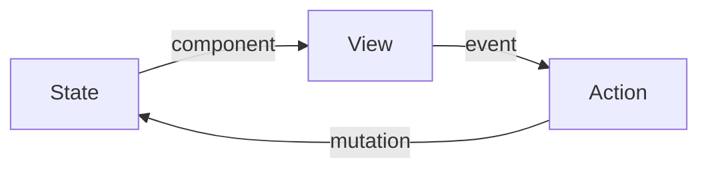

# Инкрементальные вычисления в UI-фреймворках

<!--
Всех приветствую. Как видно из названия, я сейчас буду говорить о фреймворках. И так как мы сейчас на конференции по JavaScript, разговор будет больше про UI в Web-е, хотя многие идеи применимы ко многим платформам, где есть графический интерфейс. Возможно, кто-то уже догадывается, что речь пойдёт про механизмы обновления UI при изменении состояния. И мы будем стремиться, чтобы пересчитывалось всё инкрементально - только то, что реально изменилось.
-->
---
level: 1
---

# Приятно познакомиться

<style>
  .two-cols-grid {
    align-items: center;
  }
</style>
<div class="flex gap-x-3">
  <div class="flex gap-x-1 text-xl"><div><b>Василий Алфертьев</b></div></div>
  <div>
    
  </div>
  <div>
    <p><logos-telegram style="display: inline; width: 32px; height: 32px" /> <b>Telegram</b>: <a href="https://t.me/alfertev2012">@alfertev2012</a></p>
    <p><logos-github style="display: inline; width: 32px; height: 32px" /> <b>GitHub</b>: <a href="https://github.com/alfertev2014">@alfertev2014</a></p>
  </div>
  <div>
    <div class="two-cols-grid">
      <div><logos-react style="display: inline; width: 64px; height: 64px" /> React</div>
      <div><logos-typescript style="display: inline; width: 64px; height: 64px" /> TypeScript</div>
    </div>
  </div>
</div>

<!--
Теперь немного обо мне. Я Василий Алфертьев, в настоящее время - frontend-разработчик в компании Открытые решения, пишу в основном на React-е, обязательно с TypeScript-ом, люблю придерживаться строгой типизации и вообще люблю, когда абстракции строгие.
-->
---
level: 2
---

# Чем ещё владею

<style>
li {
  margin-block: 0;
  line-height: 1.5rem;
}
</style>
<div class="two-cols-grid">

<div>

- 5+ лет в **С++**:
  - системное программирование
  - Linux
  - UI на Qt

</div>
<div v-click="1">

- Увлекаюсь
  - **дизайном языков программирования**
  - best practices и архитектурой ПО
  - computer science

</div>
<div>

- ~6 лет в **Java**:
  - backend на Spring
  - базы данных
  - монолиты, микросервисы…

</div>
<div v-click="1">

<ul>
<li>Тянет разбираться в
  <ul>
  <li>компиляторах и оптимизациях</li>
  <li>"кишках" runtime разных языков</li>
  <li>IDE и инструментах</li>
  <li>Устройстве UI-фреймворков и библиотек</li>
  </ul>
</li>
</ul>
</div>
</div>

<!--
Начинал интересоваться устройством UI-фреймворков ещё в C# во времена WinForms, много писал UI на Qt. Параллельно много погружался в различные интересные темы computer science, связанные с компиляторами. И с развитием Web-технологий UI-фреймворки для меня не менее интересны.
-->
---
level: 1
layout: two-cols
---

<div v-click>

# 🚀 Реактивность

- Сигнальная реактивность
- Компилируемая реактивность

</div>

::right::

<div v-click>

# 📜 Декларативность

- Domain Specific Language (DSL)
- Строгие абстракции

</div>
<!--
Сразу прямо скажу, что весь доклад будет про реактивность - про то, как UI *реагирует* на изменения данных состояния приложения.

1. В основном будем касаться *сигнальной* реактивности, её возможной реализации и неочевидных особенностей.
2. Также рассмотрим идею *компилируемой* реактивности как способа создать *иллюзию*, что чистые функции, то есть, описанные в чисто-функциональной парадигме, перевычисляются инкрементально.

А ещё, я буду много останавливаться на ортогональной теме декларативного программирования для UI.

1. Ведь чистое функциональное программирование тоже в каком-то смысле декларативное. Но настоящие преимущества декларативного программирования начинаются с применения доменно-специфичных языков, или DSL, которые приближены к естественному языку, на котором мы формулируем задачи и пишем спецификации.
2. И очень важно, чтобы код не просто выглядел читаемым и понятным, как спецификация, но ещё и давал нам какие-то гарантии, чтобы мы верили в то, что в нём написано. Поэтому будем добиваться, чтобы абстракции, создаваемые нашими декларативными языками, были строгими.
-->
---
level: 2
---

# Основная идея

<div class="text-center">


<div v-click>


</div>
</div>

<!--
Ну, и давайте я сразу раскрою смысл названия доклада.

Основная идея инкрементальных вычислений заключается вот в чём. Есть у нас чистая функция, преобразующая некоторый аргумент в результат без побочных эффектов. Представьте, что тут аргумент может быть большой и сложный, например, целое дерево данных. Функция тоже может быть композицией других функций. И результат тоже может быть большим и сложным.

И если мы внесём небольшие изменения в аргумент, то вместо того, чтобы делать полный перезапуск вычисления всей функции, мы хотели бы сделать такие минимальные действия, основанные на коде этой функции, чтобы точечно изменить результат, оставшийся от предыдущих вычислений.
-->
---
level: 2
---

# Все фреймворки похожи друг на друга

- Ментальная модель UI
- **Инкрементальное** обновление view при изменении state
- Сигнальная реактивность как эффективная реализация

<!--
Эта идея всё больше прослеживается в UI.

У всех фреймворков в последнее время стало много общего, они всё больше становятся похожи друг на друга.

1. И всё это потому, что они стараются моделировать одну и ту же *абстракцию* пользовательского интерфейса. И отличаются они только *способами* и *строгостью* реализации этой абстракции. И именно от понимания этой абстракции и механизмов её реализации *исходят* все *паттерны* использования фреймворка и *best practices*.
2. И уже в этой абстрактной модели можно отметить фазу инкрементального обновления представления. В модели UI очень удобно представлять view как чистую функцию от state. И именно про инкрементальные вычисления *этой* функции мы и будем говорить.
3. Во многие фреймворки уже пробралась идея сигнальной реактивности как реализации инкрементальных вычислений. Есть даже proposal для добавления сигналов прямо в JavaScript runtime. Но об этом позже.
-->
---
level: 1
layout: cover
---

# UI-фреймворки и ментальная модель UI

<!--
Вот я всё говорю тут: "фреймворки, фреймворки...". Давайте сначала определимся, что собираемся рассматривать - что мы будем понимать под UI-фреймворками и чего мы от них хотим.
-->
---
level: 2
---

# Чего мы хотим от UI-фреймворка?

Повышение продуктивности при разработке UI:

- Улучшение Developer Experience в понятной парадигме
- Автоматически оптимизированный результат на выходе

<!--
Итак, чего же мы хотим от UI-фреймворка, как и от любого другого инструмента или решения?

1. Это, конечно же, повышение нашей продуктивности по сравнению с разработкой без фреймворка. И обычно есть два аспекта: 
2. Мы хотим, чтобы код можно было писать удобно и понятно для нас - в понятной парадигме. Это так называемый Developer Experience.
3. И в то же время мы хотим, чтобы этот код не тормозил, не съедал много памяти - и всё это было волшебным образом само собой, автоматически.

Фреймворк должен снимать с нас большую часть забот, повторяющихся из проекта в проект, чтобы мы сосредоточили своё внимание на том, что по настоящему *специфично* для проекта. Иными словами, мы хотим оставаться в той абстракции, которая нам интересна, а фреймворк должен быть инструментом обеспечения её корректной реализации, скрывая от нас низкоуровневые детали.
-->
---
level: 3
---

# Фреймворки? Библиотеки? Языки? Абстракции?

Что на чём стоит:

- Язык программирования и его runtime
- Библиотеки для типовых задач на нём
- Слой абстракции с другой парадигмой (будем рассматривать это)
- Библиотеки компонентов и утилит на этом слое
- UI-киты (кто-то назвал бы UI-фреймворком именно это)
- Каталоги больших готовых компонентов
- Конструкторы сайтов и CMS
- Коробочные решения

<!--
Я не просто так заостряю внимание на этом моменте про абстракции. Потому что по сути весь доклад именно об одной из этих абстракций.

В чём разница между фреймворком и библиотекой?

1. Есть у нас в браузере язык программирования JavaScript и его runtime, а также различные Web API - это некоторый условно низкий уровень абстракции для нас.
2. Над этим слоем живут разные библиотеки, которые упрощают работу с базовым слоем, но мы всё ещё можем с этими библиотеками писать на JavaScript как хотим, они нам ничего не навязывают, они рассчитаны, чтобы интегрироваться друг с другом.
3. А можно построить следующий уровень абстракции с несколько иной парадигмой, чем то, что даёт базовый универсальный язык. Причём, это называется "слой" в том смысле, что он берёт на себя всё, старается полностью скрыть нижележащий слой, не давая нам бесконтрольно им пользоваться - путём специальных *соглашений*, создания своих языков (DSL), языков шаблонов. Здесь и живут многие общеизвестные UI-фреймворки. И я, как раз, и буду говорить весь доклад про *этот* слой абстракции.
4. А уже в рамках этих фреймворков - в *парадигме*, которую они создают - существуют свои *библиотеки*. Например, компонентов. Или директив. Или хуков, или комбозаблов.
5. И даже из всего этого не так просто создать готовое типовое приложение. Поэтому некоторые считают, что UI-фреймворками стоит называть что-то наподобие UI-китов, которые могут создавать свои соглашения и *более* высокоуровневые абстракции.
6. На основе которых могут строиться более крупные готовые компоненты.
7. И если дальше так идти, повышая уровень абстракции и уменьшая универсальность, то там выше будут конструкторы сайтов, CMS, LowCode/NoCode.
8. В пределе на самой вершине окажутся коробочные решения, где у вас свобода будет - только настраивать конфиги.

Мы сосредоточимся на слое абстракции, довольно низкоуровневом, который задаёт парадигму мышления о UI, на которой и строятся большинство фреймворков. И в рамках этой парадигмы пристальнее посмотрим, как реализуется реактивность.
-->

---
level: 3
---

# Ментальная модель UI

Слой абстракции, контракт между разработчиком UI и фреймворком.



- UI разделяется на дерево компонентов с жизненным циклом
- Состояние, изменяемое во времени
- Представление, производное от состояния (чистая функция)
- Возможности для пользовательских действий
- Другие фоновые события
- Действия над состоянием

<!--
Быстро вспомним, как мы себе представляем UI. Примерно так же себе представляет его и пользователь.

1. Это некоторая иерархическая структура из элементов (компонентов), которые могут появляться и исчезать, то есть, обладают жизненным циклом.
2. Некоторые компоненты могут иметь состояние, изменяемое во времени, привязанное к жизненному циклу компонентов.
3. То, что видит пользователь - это представление, которое рисуется на основе данных, производных от состояния. И это отображение можно определить чистой функцией.
4. У представления есть средства для выполнения пользовательских действий - кликов, жестов, нажатий клавиш.
5. Также, в приложении могут происходить другие фоновые события, например, таймеры или завершение загрузки данных с сервера. Они выступают триггерами для
6. модификации состояния UI - простые транзакции по изменению данных, описывающие новое состояние на основе предыдущего (тоже чисто функционально).
-->

---
level: 3
layout: center
---

Большая часть UI укладывается в эту модель.

Исключения из правил фреймворка можно (нужно!) держать в коде отдельно.

<!--
Большая часть UI укладывается в эту модель. В любом типовом UI будут компоненты, цикл обновления представления и потоки данных, описываемые чистыми функциями. В этом и состоит идея фреймворка - упросить нам работу с этой большей частью UI и сделать это наиболее оптимально.

А все нестандартные компоненты, такие как canvas, карты, плееры, или директивы, интеграции и другие специальные возможности, требующие доступа к низкоуровневым API нужно держать в кодовой базе отдельно. Они выступают адаптерами возможностей для фреймворка, своего рода расширениями языка.
-->
---
level: 3
---

# Привязка ко времени

- Развитие UI во времени синхронизируется с "тиками" некоторого планировщика (event loop)
- Изменения состояния группируются в "транзакции", каждая соответствует некоторому "тику"
- Мгновенное обновление представления с новым состоянием в пределах одного "тика" (в каждом фрейме пользователь видит актуально отрисованный UI)
- Асинхронные операции могут растягиваться на много "тиков", обновления представления могут накладываться во времени (не рассматриваем в докладе)

<!--
В реализации любого UI всегда присутствует некоторый планировщик, наподобие event loop. Хотя есть и новый API scheduler, и requestAnimationFrame, и некоторые фреймворки могут иметь свою реализацию очередей с приоритетами.
Существуют условные "тики" - моменты времени, в которые представление должно быть актуально. Любые операции между тиками должны приводить к актуальному UI. А актуальный UI - это когда представление в точности соответствует состоянию по правилам отображения.

Как бы ни хайповало функциональное программирование с иммутабельностью в свои годы, а UI - это всё-таки живая система с изменяемым состоянием, развивающимся во времени.

-->
---
level: 3
---

# Не рассматриваем

- Запросы на сервер
- Асинхронные операции
- Анимации и transitions
- SSR
- Специфические оптимизации работы с DOM

---
level: 1
layout: cover
---

# Инкрементальные вычисления

---
level: 2
layout: center
---

```ts
const a = 40
const b = 2

const c = a + b
```

---
level: 2
layout: center
---

````md magic-move
```ts
const a = "The "
const b = "Answer"

const c = a + b
```
```ts
const a = "The Answer"
const b = "Life and Universe and Everything"

const c = `${a} to ${b}`
```
````

---
level: 2
layout: center
---

```ts
const a = 100500.0
const b = "Whatever"

const c = { foo: a, bar: b }
```

---
layout: 2
---

# В JavaScript нет реактивности


---
level: 2
---

# Декларативность и ментальная модель UI

---
level: 3
---

# Декларативность

Когда не думаешь об объектах, исполнении, производительности и потреблении памяти

---
level: 3
---

### Преимущества слоя абстракции

- Оставаться в удобной парадигме декларативного программирования
- Оптимизация исполнения скрыта реализацией

---
level: 1
layout: cover
---

# Инкрементальное обновление UI

---
level: 3
---

# Наблюдение о данных

Данные бывают:

- Первичные данные
- Производные данные - чистые функции от первичных данных

Операции над данными

Процесс приведения данных в консистентное состояние

Бывает, что в состоянии отделяют:

- состояние приложения с бизнес-логикой (state manager)
- состояние представления (view model)

Состояние представления, как правило, простое:

- примитивные значения
- древовидные локальные данные компонентов
- состояние UI-элементов: размеры, скролл, фокус


---
level: 2
---

# Подходы к реализации

- Статические трансформации кода
  - Компилируемая реактивность (Svelte 4)

- Динамические реализации
  - Перевычисление отдельных частей результата (React)
  - Fine-graned reactivity - избегание лишних перевычислений (Vue 3, Svelte 5, Solid и т.д.)

---
level: 2
---

### Сигнальная реактивность

- Построение графа зависимостей между данными
  - явный или автоматический трекинг зависимостей
- Выбор алгоритма стабилизации
  - push-модель
  - pull-модель
  - push/pull-модель
- Различие между данными и узлами реактивного графа

Недостатки:

- небольшой boilerplate
- возможность "потерять реактивность"

---
level: 2
---

### Компилируемая реактивность

AST-исходника чистой функции представления от состояния - основа для реактивного графа.

Автоматически все изменяемые данные становятся сигналами, производные выражения - computed. Значения, участвующие в результате - эффекты.

Ограничения и предположения:

- Императивные вызовы, циклы в чистой функции представления запрещены.
- Транзакции изменения состояния - только в обработчиках событий.
- Произвольный JavaScript запрещён.

Анализ AST исходника для построения реактивного графа напоминает алгоритм вывода типов. Если за основу взять TypeScript+JSX, то нам нужен более строгий TypeScript + гарантии чистоты функций + ограничение на работу с данными состояния.

---
level: 2
---

### Моделирование данных

Состояние может быть глобальным или локальным у компонентов.

Важен жизненный цикл:

- каждое состояние привязано к области видимости scope
- стадии: инициализации (создание графа зависимостей), монтирование

Scope бывают:

- глобальная
- тело компонента
- ветка if
- iife

Состояние может быть только деревом данных (POJO, сериализуемые в JSON).

Объяснить понятие identity объектов.

Чётко разделяем, где у нас "реактивные узлы" с identity, а где данные value types, которые по ним протекают.

У реактивного узла три уровня изменяемости/константности:

- по настоящему immutable
- реактивный readonly
- реактивный изменяемый

В чистом функциональном программировании все данные - value types без identity.
Узлы реактивного графа (ref, computed) обладают identity. В сигнальной реактивности мы строим этот граф вручную на JavaScript, а в компилируемой автоматически по исходнику.
Scope с жизненным циклом обладают identity.

Вложенная реактивность. Если в дереве данных можно изменять поддеревья, то identity вложенных объектов привязано к identity корня дерева. Чётко различаем жёсткие и слабые ссылки.

Иногда нужно передать изменяемую ссылку на поддерево в дочерний компонент. Нужна специальная конструкция привязки модели (bind). Все операции над этим поддеревом связаны с identity корня этого дерева.

С текущего состояния с identity можно снять снимок как POJO без identity.

Похоже на семантику "владения" и "заимствования" из Rust.

---
level: 1
---

# Proof of concept

- AST для DSL
- Исходники могут быть, например, TypeScript+JSX
- реализация сигнальной реактивности
- Компилятор DSL в графы сигнальной реактивности
- Оптимизации на основе статической информации о потоках данных

Показать TodoMVC

---
level: 1
---

## Заключение

Большая часть UI описывается декларативно ментальной моделью, в которой представление = чистая функция от состояния
UI-фреймворк - слой абстракции, реализующий модель UI в браузере
Инкрементальные вычисления - способ оптимальной реализации реактивного обновления представления, оставаясь в парадигме ментальной модели UI
Сигнальная реактивность - динамическая реализация инкрементальных вычислений
Компилируемая реактивность - автоматическое преобразование декларативного реактивного кода в императивный код реализации
Компиляция требует выполнения ограничений и соглашений - мы уже не пишем на JavaScript
