<h1>Инкрементальные вычисления <br/>в UI-фреймворках</h1>

<!--
Всех ещё раз приветствую!

Как видно из названия доклада, я сейчас буду говорить о фреймворках и одной любопытной модели вычислений. Доклад будет визионерский, про мой взгляд на фреймворки.
-->
---
level: 1
hideInToc: true
---

# Приятно познакомиться

<div class="grid grid-cols-2 gap-4 items-center">
  <div class="flex gap-x-1 text-xl items-center"><div><b>Василий Алфертьев</b></div></div>
  <div>
    
  </div>
  <div>
    <p><logos-telegram style="display: inline; width: 32px; height: 32px" /> <b>Telegram</b>: <a href="https://t.me/alfertev2012">@alfertev2012</a></p>
    <p><logos-github-icon style="display: inline; width: 32px; height: 32px"/> <b>GitHub</b>: <a href="https://github.com/alfertev2014">@alfertev2014</a></p>
  </div>
  <div class="flex gap-3 items-center">
    <logos-react style="display: inline; width: 64px; height: 64px" /><div>React</div>
    <div></div>
    <logos-typescript-icon style="display: inline; width: 64px; height: 64px" /><div>TypeScript</div>
  </div>
</div>

<!--
Давайте расскажу вам, кто я такой. Я Василий Алфертьев, в настоящее время - frontend-разработчик в компании Открытые решения, пишу в основном на React-е, обязательно с TypeScript-ом, люблю придерживаться строгой типизации и вообще люблю, когда абстракции строгие.
-->
---
level: 2
hideInToc: true
---

# Чем ещё владею

<style>
li {
  margin-block: 0;
  line-height: 1.4rem;
}
</style>
<div class="grid grid-cols-2 gap-x-4 gap-y-2">

<div>
  <ul>
    <li>5+ лет в <logos-c-plusplus /> <b>C++</b>
      <ul>
        <li>системное программирование</li>
        <li><logos-linux-tux/> Linux</li>
        <li>UI на <logos-qt/></li>
      </ul>
    </li>
  </ul>
</div>
<div v-click="1">
  <ul>
    <li>Увлекаюсь
      <ul>
        <li>дизайном языков программирования</li>
        <li>best practices и архитектурой ПО</li>
        <li>computer science</li>
      </ul>
    </li>
  </ul>
</div>
<div>
  <ul>
    <li>~6 лет в <logos-java/> <b>Java</b>
      <ul>
        <li>backend на <logos-spring/></li>
        <li>базы данных</li>
        <li>монолиты, микросервисы…</li>
      </ul>
    </li>
  </ul>
</div>
<div v-click="1">
  <ul>
    <li>Тянет разбираться в
      <ul>
        <li>компиляторах, IDE и инструментах</li>
        <li v-mark.circle.red="2"><b>Устройстве UI-фреймворков и библиотек</b></li>
      </ul>
    </li>
  </ul>
</div>
</div>

<!--
1. Когда-то занимался и системным программированием на C++, писал UI на Qt, прошёл через backend-разработку на Java.

2. Параллельно много погружался в различные интересные темы computer science, связанные, в основном, с компиляторами и языками.

3. И с развитием Web-технологий UI-фреймворки для меня становились всё более интересны изнутри. О них я и буду говорить в докладе.
-->
---
level: 2
layout: center
---

# UI-фреймворки

<!--
Итак, UI-фреймворки. Прежде чем начать, давайте посмотрим, кто сейчас в аудитории.
-->
---
level: 2
layout: image
image: images/statistics.jpg
backgroundSize: contain
---

<style>
  .caption {
    color: black;
    font-size: 1.5em;
    font-weight: 700;
  }
</style>

<div v-drag="[237,25,538,74]" class="caption"><logos-vue/> Vue лучше, чем <logos-react/> React!</div>

<div v-drag="[656,174,260,96]" class="caption">Я просто пишу на <logos-jquery/></div>

<div v-drag="[98,227,268,116]" class="caption">Я просто пишу на <logos-jquery/></div>

<!--
Кто пишет на React, поднимите руку? А у кого основной фреймворк - это Vue? Ангулярщики есть в зале? Svelte? А кто хотя бы знаком с Solid JS?

Да, были времена, когда новые JavaScript-фреймворки выходили каждый день, и были популярны холивары на тему, какой же фреймворк чем лучше. Да и сейчас, в эпоху ИИ это всё ещё продолжается.
-->
---
level: 3
---

# Чего мы хотим от UI-фреймворка?

<div>
<br />

<div class="text-xl" v-click>

<p>Повышение <span v-mark.red="[1,2]">продуктивности</span> при разработке UI</p>

</div>

<v-clicks>
  <ul>
    <li>Улучшение Developer Experience <span v-mark.red="[2,3]">в понятной парадигме</span></li>
    <li><span v-mark.red="3">Автоматически</span> оптимизированный результат</li>
  </ul>
</v-clicks>
</div>

<!--
Потому что экосистема всё ещё в поисках, как бы сделать ещё лучше. Мы постоянно хотим, чтобы что-то стало лучше: мы ждём новых версий, новых возможностей.

А чего же мы хотим от UI-фреймворка, как и от любого другого инструмента или решения?

1. Это, конечно же, повышение нашей продуктивности по сравнению с работой без него. И здесь есть два аспекта: 
2. Мы хотим, чтобы код можно было писать удобно для нас - в понятной парадигме. Это так называемый Developer Experience.
3. И в то же время мы хотим, чтобы этот код не тормозил, не съедал много памяти - и всё это было волшебным образом само собой, автоматически.

Фреймворк должен снимать с нас большую часть забот, повторяющихся из проекта в проект, чтобы мы сосредоточили своё внимание на том, что по настоящему *специфично* для проекта. Иными словами, мы хотим оставаться в той абстракции, которая нам интересна, а фреймворк должен быть инструментом обеспечения её корректной реализации, забирая от нас необходимость погружаться в низкоуровневые детали.
-->
---
level: 3
---

<div class="grid grid-cols-2 gap-4">
  <div>
    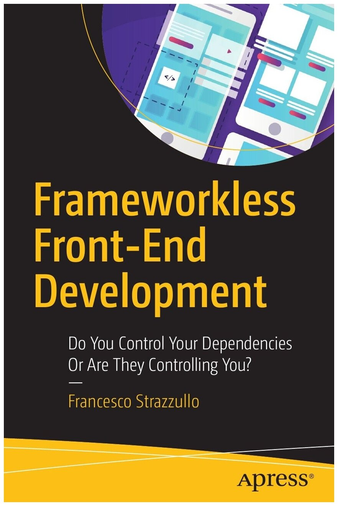
  </div>
  <div>
    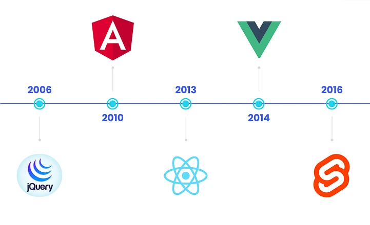
  </div>
</div>

<!--
Я тоже был когда-то в поисках и метался между тем, чтобы отказаться от фреймворков вообще, как советовалось в книге Fremeworkless Web Development (Ведь можно же писать на Vanilla JS и вэб-компонентах), или изучать хайпующий на тот момент фреймворк. Каждый год новый.

Только со временем у меня сформировалась картина, чего я от фреймворка хочу и почему мне это кажется важным. В результате, практикуясь на Vanilla JS, я постепенно нарастил свой фреймворк, чтобы через него постигать идеи, лежащие в основе других фреймворков.
-->
---
level: 3
---

<div class="grid grid-cols-2 gap-4 text-center">
  <div class="card">
    <div class="card-header">🚀 Реактивность</div>
    <div>
      <p>Реактивное обновление представления при изменении состояния</p>
    </div>
  </div>
  <div class="card">
    <div class="card-header">📜 Декларативность</div>
    <div>
      <p>Описание структуры и поведения UI на декларативном DSL</p>
    </div>
  </div>
</div>
<div class="card text-center" style="width:50%;margin: 1em auto">
  <div class="card-header">✅ Строгость</div>
  <div>
    <p>Строгая типизация, ограничения, инкапсуляция для выполнения гарантий</p>
  </div>
</div>

<!--
И отметил для себя следующие ключевые моменты, которые трудно самому переизобретать и обеспечивать на Vanilla JS, из-за чего и требуется фреймворк:
- Реактивность
- Декларативность
- Строгость

Именно эти вещи и способствуют повышению developer experience и позволяют фреймворку быть оптимизированным.
-->
---
level: 3
class: bg-image-gradient-right
style: '--slide-background-image: url(./images/layers.jpg)'
---

# Фреймворки и слои абстракции

- Коробочные решения
- Конструкторы сайтов, CMS, NoCode
- Каталоги готовых компонентов, LowCode
- UI-киты
- Библиотеки компонентов, утилит и тем
- **Слой абстракции с другой парадигмой** <logos-react /> <logos-vue/> <logos-angular-icon/> <logos-svelte-icon/> <logos-solidjs-icon/> <logos-preact /> <logos-ember/>  ...
- Общие библиотеки для типовых задач
- Язык программирования и его runtime

<!--
Давайте сейчас определимся, что мы будем называть фреймворками. Любые популярные фреймворки - что React, что Vue и другие - создают свой слой абстракции, который в каком-то смысле меняет парадигму языка, на котором они стоят, то есть JavaScript. Именно об этот уровень фреймворков мы будем рассматривать. Хотя разумно было бы называть фреймворками целые UI-киты или даже больше. Итак, фреймворк создаёт свой слой абстракции, свой особенный язык с соглашениями, и мы уже не пишем на нижележащем JavaScript.
-->
---
level: 3
---

# Фреймворки похожи друг на друга

<div class="text-center grid grid-cols-2">
<div>

**Компонентная модель**

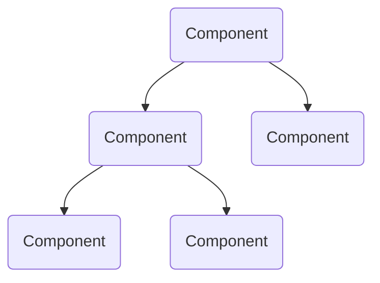
```mermaid
flowchart TD
  с1(Component) --> c2(Component)
  с1(Component) --> c3(Component)
  c2(Component) --> c4(Component)
  c2(Component) --> c5(Component)
```

</div>
<div>

**Цикл обновления**

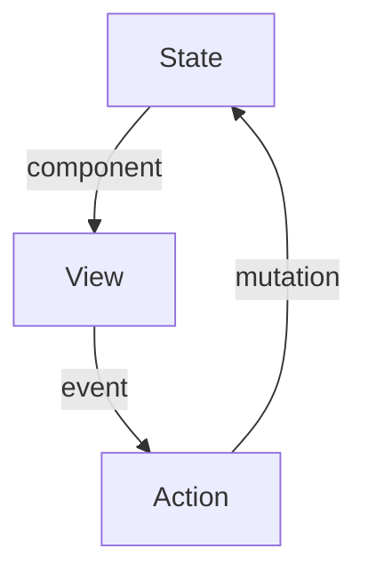
```mermaid
flowchart TD
  State -- component --> View
  View -- event --> Action
  Action -- mutation --> State
```

</div>
</div>

<!--
И так как абстракция, к которой мы стремимся, для всех фреймворков одна - это некая ментальная модель UI - то все популярные фреймворки в последнее время стали похожи друг на друга и обмениваются одиними удачными идеями реализации. Практически везде можно увидеть компонентную модель и привычный уже всем цикл обновления представления при изменении состояния.
-->

---
level: 3
---

# MVC --> MVP --> MVVM --> ...

<div class="text-center">

<v-click>

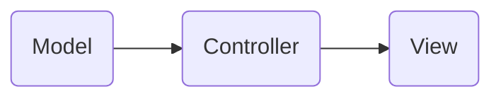
```mermaid
flowchart LR
  M(Model) --> C(Controller) --> V(View)
```

</v-click>
<v-click>

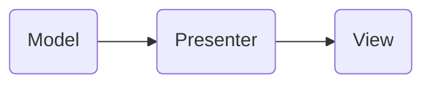
```mermaid
flowchart LR
  M(Model) --> P(Presenter) --> V(View)
```

</v-click>
<v-click>

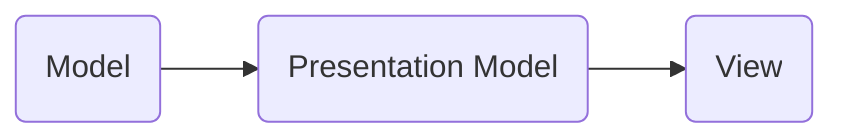
```mermaid
flowchart LR
  M(Model) --> PM(Presentation Model) --> V(View)
```

</v-click>

<v-click>

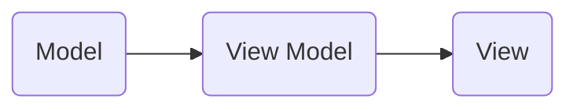
```mermaid
flowchart LR
  M(Model) --> VM(View Model) --> V(View)
```

</v-click>
</div>

<!--
различные паттерны MVC, MVP, MVVM. Если честно, я сам до конца не понимаю всех тонкостей различия между ними. Я лишь могу понять, в какие моменты логика описана императивно, а в какие декларативно. Были времена, когда считалось нормой на основе начального состояния отрисовать представление, а потом по событиям взаимодействия с ним менять данные состояния и одновременно стараться выполнить все необходимые действия по обновлению представления в надежде, что результирующее представление будет актуальным и соответствовать текущему состоянию. На деле легко было ошибиться и 
Сложные интерактивные и динамичные UI всегда завязаны на логику работы с состоянием, отделённого от представления, и потоками данных для их синхронизации. И как ни крути, логика, связывающая состояние с представлением, очень удобно описывается чистой функцией.
-->
---
level: 3
---

<div class="grid grid-cols-3 gap-2">
  <div class="card">
    <div class="card-header">State</div>
    <div>(Дерево данных)</div>
  </div>
  <div class="card">
    <div class="card-header">Logic</div>
    <div>(Код компонента)</div>
  </div>
  <div class="card" style="position:relative">
    <div class="card-header">View</div>
    <div style="position:absolute;z-index:1">
      
    </div>
    <div>(Дерево UI)</div>
  </div>
</div>

---
level: 2
---

# Инкрементальные вычисления

<div class="text-center">

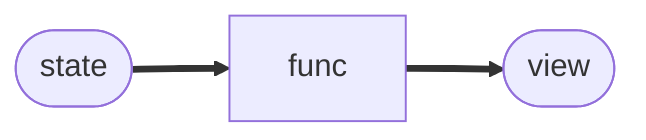
```mermaid
flowchart LR
  state([state]) ==> func ==> view([view])
```

<div v-click>

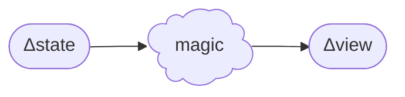
```mermaid
flowchart LR
  delta([Δstate]) --> magic@{ shape: cloud } --> deltaView([Δview])
```

</div>
</div>

<!--
Основная идея инкрементальных вычислений заключается вот в чём. Есть у нас чистая функция, преобразующая некоторый аргумент в результат без побочных эффектов. Представьте, что тут аргумент может быть большой и сложный, например, целое дерево данных. Функция тоже может быть композицией других функций. И результат тоже может быть большим и сложным.

И если мы внесём небольшие изменения в аргумент, то вместо того, чтобы делать полный перезапуск вычисления всей функции, мы хотели бы сделать такие минимальные действия, основанные на коде этой функции, чтобы точечно изменить результат, оставшийся от предыдущих вычислений.
-->

---
level: 3
---

# Как описывать изменения дерева данных?

<div class="grid grid-cols-2 gap-4">
<div v-click>

Новая версия данных

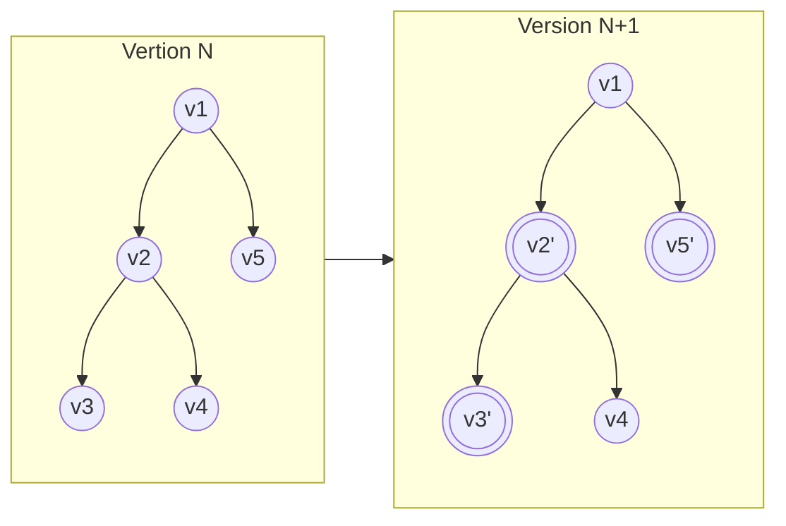
```mermaid
flowchart LR
  subgraph gv1 [Vertion N]
    direction TD
    v1((v1)) --> v2((v2)) --> v3((v3))
    v2 --> v4((v4))
    v1 --> v5((v5))
  end
  subgraph gv2 [Version N+1]
    direction TD
    g1((v1)) --> g2(((v2'))) --> g3(((v3')))
    g2 --> g4((v4))
    g1 --> g5(((v5')))
  end
  gv1 --> gv2
```

</div>
<div v-click>

"Patch" данных

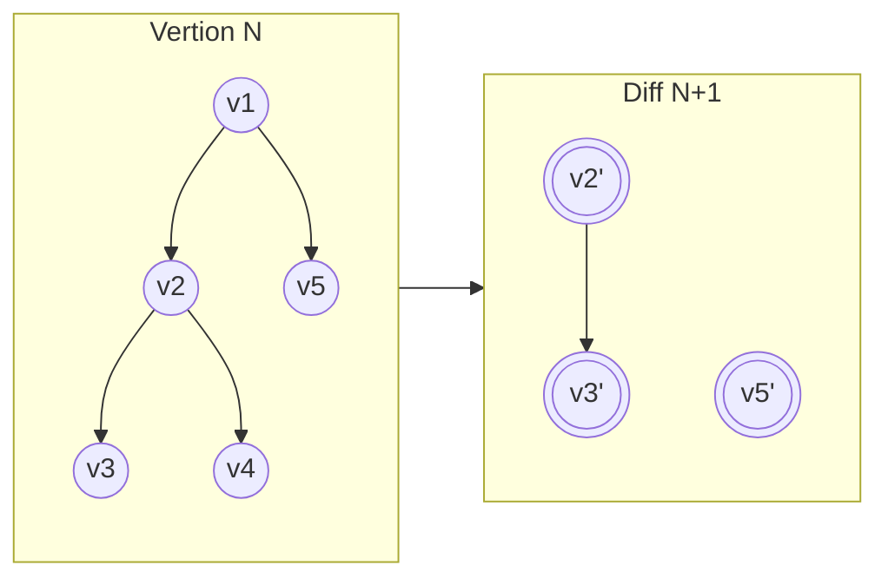
```mermaid
flowchart LR
  subgraph gv1 [Vertion N]
    direction TD
    v1((v1)) --> v2((v2)) --> v3((v3))
    v2 --> v4((v4))
    v1 --> v5((v5))
  end
  subgraph gv2 [Diff N+1]
    direction TD
    g2(((v2'))) --> g3(((v3')))
    g5(((v5')))
  end
  gv1 --> gv2
```

</div>
</div>
<!--
И нельзя сказать однозначно, что удобнее.
-->
---
level: 3
---

# Инкрементальные вычисления

- **Реактивность**: обновление результата при изменении входных данных
- **Декларативность**: описание результата как чистой функции от входных данных
- **Строгость**: легко обеспечить соблюдение соглашений для гарантий корректности и избежания ошибок

<v-click>

Слой абстракции поверх JavaScript, часть ментальной модели UI.

- Способствует улучшению Developer Experience
- Позволяет фреймворку оптимизации

</v-click>

---
level: 2
class: bg-image-gradient-right
style: '--slide-background-image: url(images/rocket.jfif)'
---

<br/><br/><br/>

# 🚀 Реактивность

<!--
...реактивность.

Сразу прямо скажу, что весь доклад будет вокруг реактивности - про то, как UI *реагирует* на изменения данных состояния приложения. Тема реактивности мне давно интересна. Но она достаточно широкая, и каждый может понимать под реактивностью что-то своё. Я бы даже сказал, что существуют разные виды реактивности, вообще отличающиеся друг от друга, но отдельного удачного термина под каждую реактивность не нашлось.

1. В самом общем приближении под реактиновстью можно считать автоматическое обновление одних данных в ответ на изменение других данных.
-->
---
level: 3
---

# Разновидности реактивности

<style>
li {
  margin-block: 0;
  line-height: 1.4rem;
}
</style>
<div class="grid grid-cols-2 gap-4">
<div class="card" v-click>
<div class="card-header">Ориентированные на данные</div>

- первичные и производные данные
- граф зависимостей

<div>Примеры: <logos-mobx/> MobX, <logos-vue/> Vue, <logos-solidjs-icon/> Solid</div>
</div>
<div class="card" v-click>
<div class="card-header">Ориентированные на события</div>

- события и потоки данных
- трансформация, фильтрация, буферизация событий и т.п.

<div>Примеры: <logos-reactivex/> Rx.js</div>
</div>
<div class="card" v-click>
<div class="card-header">Гибрид первых двух</div>

- подробный граф из событий, данных и действий с ними

<div>Примеры: <logos-effector/> Effector</div>
</div>
<div class="card" v-click>
<div class="card-header">Основанные на перевычислении</div>

- rerender частей приложения
- reconcilliation результатов

<div>Примеры: <logos-react/> React</div>
</div>
</div>

<!--
А если пуститься в детали, то можно выделить, например,

1. реактивность, которая строится вокруг данных и построения графа зависимостей между ними. И я лично для себя реактивность представляю именно так. Примером реализации такой реактивности может служить сигнальная реактивность: библиотека MobX, современный Vue, Solid js.

2. Бывает другое популярное представление о реактивности - это потоки данных и других произвольных событий. В этом случае тоже выстраивается граф. Но не узлов, в которых хранятся данные. А узлами являются обработчики протекающих по ним данных. Пример библиотеки, которая здесь сразу вспоминается, это Rx.js. Для меня это уже не совсем та реактивность, о которой я думал. И в докладе мы такой тип реактивности рассматривать не будем.

3. Где-то посередине между этими двумя типами можно расположить Effector, в котором формируется подробный граф, где узлами являются и хранилища данных, и события, и действия по их обработке. Это уже нечно большее, чем просто реактивность, так как граф рассчитан на описание всей бизнес-логики приложения и содержит и императивные операции.

4. И вот сейчас может быть неожиданно. React тоже реактивен. Хотя когда-то говорили, что React не реактивен, хоть и называется React-ом. Он по своему реактивен, как мы далее увидим, когда поговорим про "гранулярность" реактивности.
-->
---
level: 3
---

<style>
  .slidev-code-wrapper {
    --slidev-code-font-size: 20px;
    --slidev-code-line-height: 1.5em;
  }
</style>

# Как я представляю реактивность?

<div class="grid grid-cols-2 gap-4">
<div>

````md magic-move {at:3}
```ts{all|1}
let U = 5

let R = 1

const I = U / R  // --> 5

const P = I * U  // --> 25
```
```ts{1|5-7}
let U = 4

let R = 1

const I = U / R  // --> ?

const P = I * U  // --> ?
```
```ts{5}
let U = 4

let R = 1

const I = U / R  // --> 4

const P = I * U  // --> ?
```
```ts{7|3}
let U = 4

let R = 1

const I = U / R  // --> 4

const P = I * U  // --> 16
```
```ts
let U = 4

let R = 0.5

const I = U / R  // --> 8

const P = I * U  // --> 32
```
```ts
let U = 1.5

let R = 2

const I = U / R  // --> 0.75

const P = I * U  // --> 1.125
```
````

</div>
<div style="position:relative">
  <div class="fill-container" v-click="[1,2]">
    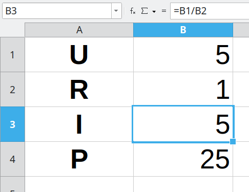
  </div>
  <div class="text-center fill-container" v-click="2">

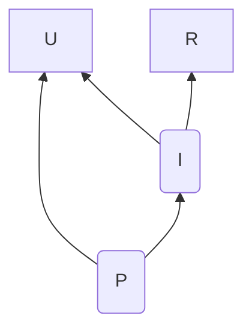
```mermaid
flowchart BT
  P(P) --> I(I)
  P --> U[U]
  I --> U
  I --> R[R]
```

  </div>
</div>
</div>

<!--
Так вот. Что я себе всегда представлял с самого начала под реактивностью? Как я уже сказал, для меня реактивность больше строится вокруг данных. А взаимосвязи между данными описываются выражениями, или можно сказать, уравнениями. Здесь я попытался показать их в синтаксисе JavaScript. Конечно, уравнения не должны противоречить друг другу.

1. Поведение напоминает Excel-таблички. И именно Excel обычно приводят в пример, когда пытаются объяснить реактивность. Для каждого вычисляемого значения можно из выражения формулы определить, от каких значений оно зависит.

2. Если составить граф из этих значений, то это должен быть ориентированный ациклический граф.

3. При изменении исходных данных должны пересчитаться все зависимые от них данные, и затем зависимые зависимых. Вся эта последовательность вычислений должна произойти за один проход таким образом, чтобы потребитель конечных данных не увидел их в состоянии промежуточных вычислений. И если мы одновременно изменим несколько значений исходных данных, то мы не хотим несолько раз перевычислять весь граф - все зависимые узлы должны пересчитаться один раз.

-->
---
level: 3
---

<div style="position:relative">
<div class="card" style="position:absolute;top:0;right:0;z-index:1">
  Псевдокод
</div>

```tsx{all|2-5|8-17|9,12,15,16|10,13|all}
const OhmsLaw = () => {
  let voltage = 1.5   // U
  let resistance = 2  // R

  const amperage = voltage / resistance  // I

  return (
    <div>
      <p>Напряжение: <input type="number" value={voltage} onInput={e => {
        voltage = e.target.valueAsNumber
      }}/></p>
      <p>Сопротивление: <input type="number" value={resistance} onInput={e => {
        resistance = e.target.valueAsNumber
      }}/></p>
      <p>Сила тока: <span>{amperage}</span> А</p>
      <p>Мощность: <span>{amperage * voltage}</span> Вт</p>
    </div>
  )
}
```

</div>

<!--
И я бы ожидал от UI-фреймворка примерно такого же. Здесь пример кода, как бы это могло выглядеть, псевдокодом в синтаксисе JSX.

1. Связи между данными описываются простыми формулами. Здесь те же выражения, что и на прошлом примере, просто стиль именования более привычный для JS.

2. UI описывается простой структурой дерева элементов

3. с привязкой реактивных данных в нужные места. Для примера я выражение для мощности написал прямо inline в шаблоне.

4. События вызывают изменения исходных данных - просто синтаксисом присваивания.

5. А в ответ на изменения происходил бы не ререндер целого компонента, а точечно изменялось бы в UI ровно то, что нужно, и промежуточные вычисления выполнялись бы минимальные.

Иными словами, хочется, чтобы код был лаконичный и понятный, как обычный JavaScript, но выполнялся бы с семантикой реактивности.
-->
---
level: 2
---

# Реактивность в JavaScript

<div class="grid grid-cols-2 gap-4">
<div class="card" v-click>
<div class="card-header">Run-time</div>

- Библиотеки реактивности
- Интеграция с фреймворками

Примеры: <logos-mobx/> MobX, <logos-reactivex/> Rx.js, <logos-vue/> Vue, <logos-solidjs-icon/> Solid

</div>
<div class="card" v-click>
<div class="card-header">Build-time</div>

- Расширение языка, трансформации кода
- +1 шаг сборки

Примеры: <logos-svelte-icon/> Svelte, TSRX, Ripple

</div>
</div>

<!--
Но проблема в том, что в JavaScript нет такой реактивности даже близко. И язык не располагает возможностями, чтобы сделать это в том виде, как я сейчас описал.

1. Поэтому приходится прибегать к решениям:

2. Это либо решения в runtime: специальные библиотеки реактивности с интеграцией прямо во фреймворк

3. Либо модифицировать язык, придумывать новый язык с семантикой реактивности, компилирующийся в JavaScript, что потребует дополнительного шага сборки.
-->

---
level: 2
---

# "Гранулярность" реактивности

<v-drag-arrow pos="59,316,873,7"/>

<div class="text-center grid grid-cols-4 gap-2">
  <div class="card">
    <div class="card-header">Пересчитать всё</div>
  </div>
  <div class="card">
    <div class="card-header">"Coarse-grained reactivity"</div>
    <div>
      <p><logos-react/> <logos-preact/></p>
    </div>
  </div>
  <div class="card">
    <div class="card-header">"Fine-grained reactivity"</div>
    <div>
      <p><logos-vue/> <logos-svelte-icon/> <logos-solidjs-icon/> <logos-mobx/></p>
    </div>
  </div>
  <div class="card">
    <div class="card-header">Пересчитать инкрементально</div>
    <div>
      <p><strong>?</strong></p>
    </div>
  </div>
</div>

<!--
Разбирая модель выполнения реактивного кода для любого решения (не важно, библиотека это или языковое расширение), стоит обратить внимание на такую характеристику как гранулярность реактивности. Этот неформальный термин был придуман некоторыми реализациями реактивности, чтобы подчеркнуть их эффективность по сравнению с другими.

Под гранулярностью понимается, насколько мелкие блоки из действий по пересчёту производных данных могут выполняться атомарно и независимо. Цель дробления операций на мелкие кусочки была в том, чтобы без толку не выполнять лишние вычисления, приводящие к тем же самым результатам.

Ведь можно по любому изменению исходных данных пересчитывать вообще всё. Это дорого, хотя где-то такой подход выигрывает. В видео-играх, например, при отрисовке каждого кадра.

Бывают реализации, допускающие некоторые лишние действия, потому что исходная причина реакции не влияет на их результат. А всё потому, что реакции организованы в довольно большие группы действий - крупные гранулы - и мы вынуждены выполнять их целиком. Отсюда и название "coarse-graned reactivity".

Есть более умные реализации, старающиеся минимизировать лишние действия. Для этого все действия реакций разбиваются на более мелкие операции, как мелкие гранулы, поэтому распространился термин "fine-graned reactivity".

В идеале, конечно, хотелось бы избежать лишних действий вообще, выполнить ровно то, что нужно для обновления производных данных, инкрементально. Но такой подход имеет свою цену. При экономии на лишних действиях мы много потеряем на организацию точности всего этого процесса.
-->

---
level: 3
---

<style>
  .slidev-code-wrapper {
    --slidev-code-font-size: 12px;
    --slidev-code-line-height: 1.1em;
  }
</style>

# "Coarse-grained reactivity": React

````md magic-move
```tsx
const OhmsLaw = () => {
  const [voltage, setVoltage] = useState(1.5)
  const [resistance, setResistance] = useState(2)

  const amperage = voltage / resistance

  return (
    <div>
      <p>Напряжение: <input type="number" value={voltage} onInput={e => {
        setVoltage(e.target.valueAsNumber)
      }}/></p>
      <p>Сопротивление: <input type="number" value={resistance} onInput={e => {
        setResistance(e.target.valueAsNumber)
      }}/></p>
      <p>Сила тока: <span>{amperage}</span> А</p>
      <p>Мощность: <span>{amperage * voltage}</span> Вт</p>
    </div>
  )
}
```
```tsx
const OhmsLaw = () => {
  const [voltage, setVoltage] = useState(1.5)
  const [resistance, setResistance] = useState(2)

  const amperage = useMemo(() => voltage / resistance, [voltage, resistance])
  const power = useMemo(() => amperage * voltage, [amperage, voltage])

  return (
    <div>
      <p>Напряжение: <input type="number" value={voltage} onInput={e => {
        setVoltage(e.target.valueAsNumber)
      }}/></p>
      <p>Сопротивление: <input type="number" value={resistance} onInput={e => {
        setResistance(e.target.valueAsNumber)
      }}/></p>
      <p>Сила тока: <span>{amperage}</span> А</p>
      <p>Мощность: <span>{power}</span> Вт</p>
    </div>
  )
}
```
```tsx{8,20-25}
const OhmsLaw = () => {
  const [voltage, setVoltage] = useState(1.5)
  const [resistance, setResistance] = useState(2)

  const amperage = useMemo(() => voltage / resistance, [voltage, resistance])
  const power = useMemo(() => amperage * voltage, [amperage, voltage])

  const [currentDirection, setCurrentDirection] = useState<"AC" | "DC">("DC")

  return (
    <div>
      <p>Напряжение: <input type="number" value={voltage} onInput={e => {
        setVoltage(e.target.valueAsNumber)
      }}/></p>
      <p>Сопротивление: <input type="number" value={resistance} onInput={e => {
        setResistance(e.target.valueAsNumber)
      }}/></p>
      <p>Сила тока: <span>{amperage}</span> А</p>
      <p>Мощность: <span>{power}</span> Вт</p>
      <p>Направление:{" "}
        <select value={currentDirection}>
          <option value="AC">Переменный ток</option>
          <option value="DC">Постоянный ток</option>
        </select>
      </p>
    </div>
  )
}
```
````

---
level: 3
---

# "Coarse-grained reactivity": React

<div class="grid grid-cols-2 gap-4">
  <div class="card" v-click>
    <div class="card-header">Преимущества</div>
    <div>
      <ul>
        <li>Это всё ещё JavaScript, который вы знаете</li>
        <li>Просто библиотека, легко интегрировать</li>
        <li v-mark.circle.red="3">Удобный "синтаксис": деструктуризация props, условный рендеринг, рендеринг массивов</li>
      </ul>
    </div>
  </div>
  <div class="card" v-click>
    <div class="card-header">Недостатки</div>
    <div>
      <ul>
        <li>Лишние rerenders</li>
        <li>"Правила хуков"</li>
        <li>Boilerplate хуков, явное перечисление зависимостей</li>
        <li>"Магия" порядка исполнения вычислений</li>
      </ul>
    </div>
  </div>
</div>

---
level: 3
---

# "Fine-grained reactivity": Сигналы (API)

```ts
type Signal<T> = {
  get: () => T
  set: (value: T) => void
}

type Computed<T> = {
  get: () => T
}

const signal = <T>(initValue: T): Signal<T> => { /* ... */ }
const computed = <T>(func: () => T): Computed<T> => { /* ... */ }
```

---
level: 3
---

# "Fine-grained reactivity": Сигналы

```ts{all|1-2|4-5|7-8|10|12-13}
const voltage = signal(5)
const resistance = signal(1)

const amperage = computed(() => voltage.get() / resistance.get())
const power = computed(() => amperage.get() * voltage.get())

console.log("amperage", amperage.get())  // --> 5
console.log("power", power.get())  // --> 25

voltage.set(4)

console.log("amperage", amperage.get())  // --> 4
console.log("power", power.get())  // --> 16
```

<!--
Одной из самых удачных библиотечных реализаций реализаций, набравшей популярность и принятной многими фреймворками, является так называемая сигнальная реактивность. Данные делятся на изменяемые первичные данные (которые здесь создаются в условном API функцией signal) и производные данные (computed), которые вычисляются выражением на основе первичных данных. Производные данные зависят от других первичных и произвоных данных. Поэтому все узлы данных объединяются в направленный ациклический граф, связывающий из отношением зависимости. Сигнал напоминает паттерн Observable. Но вместо того, чтобы сразу вызывать коллбэк по изменению данных, сначала происходит распространение уведомления тем узлам, которые необходимо пересчитать, а сами вычисления выполняются в правильном порядке в отдельной фазе, чтобы каждый computed вычислялся только с актуальными версиями своих зависимостей.
-->
---
level: 3
---

# "Fine-grained reactivity": Сигналы

<div class="grid grid-cols-2 gap-4">
  <div class="card" v-click>
    <div class="card-header">Преимущества</div>
      <div>
      <ul>
        <li>Избегание лишних вычислений</li>
        <li>Это всё ещё JavaScript, который вы знаете</li>
        <li>Просто библиотека, легко интегрировать</li>
      </ul>
    </div>
  </div>
  <div class="card" v-click>
    <div class="card-header">Недостатки</div>
      <div>
      <ul>
        <li>"Магия" порядка исполнения вычислений</li>
        <li v-mark.circle.red="3">Boilerplate создания сигналов и computed, получения и изменения значений</li>
        <li v-mark.circle.red="3">Возможность "потерять реактивность"</li>
      </ul>
    </div>
  </div>
</div>

---
level: 3
---

# Сигналы: computed внутри computed?

````md magic-move
```ts{all|5-7}
const amperage = signal(1)
const resistance = signal(5)

// P == I^2 * R
const power = computed(
  () => amperage.get() * amperage.get() * resistance.get()
)
```
```ts{6}
const amperage = signal(1)
const resistance = signal(5)

// P == I^2 * R
const power = computed(
  () => computed(() => amperage.get() * amperage.get()).get() * resistance.get()
)
```
```ts{4-7}
const amperage = signal(1)
const resistance = signal(5)

const amperageSquare = computed(() => amperage.get() * amperage.get())

// P == I^2 * R
const power = computed(() => amperageSquare.get() * resistance.get())
```
````

---
level: 3
---

# Сигналы: Потеря реактивности

````md magic-move
```ts
const amperage = signal(2)
const resistance = signal(1)

const power = computed(() => amperage.get() * amperage.get() * resistance.get())
```
```ts{4-6}
const amperage = signal(2)
const resistance = signal(1)

const voltage = amperage.get() * resistance.get()  // --> 2

const power = computed(() => amperage.get() * voltage)  // --> 4
```
```ts{8-10}
const amperage = signal(2)
const resistance = signal(1)

const voltage = amperage.get() * resistance.get()  // --> 2

const power = computed(() => amperage.get() * voltage)  // --> 4

resistance.set(2)

console.log(power.get())  // 4
```
```ts{4|10}
const amperage = signal(2)
const resistance = signal(1)

const voltage = computed(() => amperage.get() * resistance.get())  // --> 2

const power = computed(() => amperage.get() * voltage.get())  // --> 4

resistance.set(2)

console.log(power.get())  // 8
```
````
---
level: 3
---

# Сигналы: Proxy-объекты

````md magic-move
```ts{all|1|4|5-8}
const reactive = <T extends Record<string, unknown>>(o: T): T => {
  const res = {} as Record<string, unknown>
  for (const [key, value] of Object.entries(o)) {
    const s = signal<unknown>(value)
    Object.defineProperty(res, key, {
      get(): unknown { return s.get() }
      set(newValue: unknown) { s.set(newValue) }
    })
  }
  return res as T
}
```
```ts{all|1|5|9-11}
const obj = reactive({ a: 42, b: true, c: "The Answer" })

const foo = computed(() => {
  // ...
  obj.a /* ... */  obj.b /* ... */ obj.c
  // ...
})

obj.a = 100500
obj.b = false
obj.c = "Whatever"
```
````

---
level: 3
---

# Сигналы: деструктуризация

````md magic-move
```ts{all|1|2-3|5|7-8|10|12-13|5}
const foo = reactive({ name: "Resistance", value: 5 })
const bar = computed(() => `${foo.name} equals to ${foo.value}`)
console.log(bar.get())  // "Resistance equals to 5"

const { name, value } = foo

const baz = computed(() => `${name} equals to ${value}`)
console.log(baz.get())  // "Resistance equals to 5"

foo.value = 2

console.log(bar.get())  // "Resistance equals to 2"
console.log(baz.get())  // "Resistance equals to 5"
```
```ts{5-6}
const foo = reactive({ name: "Resistance", value: 5 })
const bar = computed(() => `${foo.name} equals to ${foo.value}`)
console.log(bar.get())  // "Resistance equals to 5"

const name = foo.name
const value = foo.value

const baz = computed(() => `${name} is ${value}`)
console.log(baz.get())  // "Resistance equals to 5"

foo.value = 2

console.log(bar.get())  // "Resistance equals to 2"
console.log(baz.get())  // "Resistance equals to 5"
```
```ts{5-6,8,14}
const foo = reactive({ name: "Resistance", value: 5 })
const bar = computed(() => `${foo.name} equals to ${foo.value}`)
console.log(bar.get())  // "Resistance equals to 5"

const name = computed(() => foo.name)
const value = computed(() => foo.value)

const baz = computed(() => `${name.get()} is ${value.get()}`)
console.log(baz.get())  // "Resistance equals to 5"

foo.value = 2

console.log(bar.get())  // "Resistance equals to 2"
console.log(baz.get())  // "Resistance equals to 2"
```
````

---
level: 2
---

# Компилируемая реактивность?

<v-clicks>

- Преобразования кода для удобства использования реактивности
- Всё тот же JavaScript, который вы знаете?

Фреймворки давно это делают

</v-clicks>

<!--
И многие фреймворки держатся за идею оставаться в рамках всем знакомого JavaScript. Хотя на самом деле применяют к нему преобразования при сборке.
-->
---
level: 2
---

# Vue.js

```html{all|6,10|6,8}
<script setup lang="ts">
interface Props {
  msg?: string
  labels?: string[]
}
const { msg = 'hello', labels = ['one', 'two'] } = defineProps<Props>()

watchEffect(() => { console.log(msg) })

const emit = defineEmits<{
  (e: 'change', id: number): void
  (e: 'update', value: string): void
}>()
</script>
```

---
level: 2
---

# Svelte

```html{all|2-5|2|4-5|6}
<script>
  let { answer = 42 } = $props();
	let count = $state(1);
	let doubled = $derived(count * 2);
	let quadrupled = $derived(doubled * 2);
	function handleClick() { count += 1; }
</script>

<p>The answer is {answer}</p>
<button onclick={handleClick}>Count: {count}</button>
<p>{count} * 2 = {doubled}</p>
<p>{doubled} * 2 = {quadrupled}</p>
```

---
level: 2
---

# Solid.js

```js{all|1-2|8-13}
function MyComponent(props) {
  const finalProps = mergeProps({ defaultName: "Ryan Carniato" }, props);
  const [count, setCount] = createSignal(1);
  const increment = () => setCount(count => count + 1);
  const doubled = createMemo(() => count() * 2);
  const quadrupled = createMemo(() => doubled() * 2);
  return (
    <div>
      <div>Hello {finalProps.defaultName}</div>
      <button type="button" onClick={increment}>Count: {count()}</button>
      <p>{count()} * 2 = {doubled()}</p>
      <p>{doubled()} * 2 = {quadrupled()}</p>
    </div>
  );
}
```
---
level: 3
---

<style>
  .slidev-code-wrapper {
    --slidev-code-font-size: 12px;
    --slidev-code-line-height: 1.1em;
  }
</style>

<h1>React <span v-click>Compiler?</span></h1>

```tsx
const OhmsLaw = () => {
  const [voltage, setVoltage] = useState(1.5)
  const [resistance, setResistance] = useState(2)

  const amperage = voltage / resistance

  return (
    <div>
      <p>Напряжение: <input type="number" value={voltage} onInput={e => {
        setVoltage(e.target.valueAsNumber)
      }}/></p>
      <p>Сопротивление: <input type="number" value={resistance} onInput={e => {
        setResistance(e.target.valueAsNumber)
      }}/></p>
      <p>Сила тока: <span>{amperage}</span> А</p>
      <p>Мощность: <span>{amperage * voltage}</span> Вт</p>
    </div>
  )
}
```

---
level: 3
---

# Реактивность во фреймворках

<div>
<v-clicks>

Фреймворки пытаются преодолеть:
- ограничения JavaScript для реализации реактивности
- неудобства API реализации реактивности

Смешиваются:
- обычный JavaScript
- API runtime-реализации реактивности
- "Магия" преобразований кода

</v-clicks>
</div>

---
level: 1
---

<br/><br/><br/>

# 📜 Декларативность


---
level: 3
---

# Декларативное программирование

<v-clicks>

- Код описывает ожидаемый результат, а не способ его получения
  - Код описывает структуру UI, потоки данных, логику приложения в виде **деклараций**, а не последовательности действий
- Domain Specific Language (DSL) вместо универсального JavaScript
- Строгие абстракции:
  - Программист сосредоточен на семантике DSL
  - Детали реализации берёт на себя фреймворк

</v-clicks>


---
level: 3
---

<DeclarativeCode :clicks="[0,1]">

````md magic-move
```tsx
const OhmsLaw = () => {
  let voltage = 1.5   // U
  let resistance = 2  // R

  const amperage = voltage / resistance  // I

  return (
    <div>
      <p>Напряжение: <input type="number" value={voltage} onInput={e => {
        voltage = e.target.valueAsNumber
      }}/></p>
      <p>Сопротивление: <input type="number" value={resistance} onInput={e => {
        resistance = e.target.valueAsNumber
      }}/></p>
      <p>Сила тока: <span>{amperage}</span> А</p>
      <p>Мощность: <span>{amperage * voltage}</span> Вт</p>
    </div>
  )
}
```
```tsx
const OhmsLaw = () => {
  const voltage = signal(1.5)   // U
  const resistance = signal(2)  // R

  const amperage = computed(() => voltage.get() / resistance.get())  // I

  return (
    <div>
      <p>Напряжение: <input type="number" value={voltage} onInput={e => {
        voltage.set(e.target.valueAsNumber)
      }}/></p>
      <p>Сопротивление: <input type="number" value={resistance} onInput={e => {
        resistance.set(e.target.valueAsNumber)
      }}/></p>
      <p>Сила тока: <span>{amperage}</span> А</p>
      <p>Мощность: <span>{computed(() => amperage.get() * voltage.get())}</span> Вт</p>
    </div>
  )
}
```
````

</DeclarativeCode>

---
level: 3
---

# Компиляция DSL в сигналы

<div class="grid grid-cols-2 gap-4">
  <div class="card" v-click>
    <div class="card-header">Преимущества</div>
    <div>
      <ul>
        <li><span v-mark.red="1">Выглядит</span> как JavaScript, который вы знаете</li>
        <li>Можно деструктурировать объекты (props)</li>
        <li>Нет boilerplate ".get()", ".set()", "signal()", "computed(() => ...)"</li>
      </ul>
    </div>
  </div>
  <div class="card" v-click>
    <div class="card-header">Недостатки</div>
     <div>
      <ul>
        <li>"Магия" порядка исполнения вычислений</li>
        <li>+1 шаг сборки</li>
        <li>Ограничения синтаксиса и используемых API</li>
      </ul>
    </div>
  </div>
</div>

---
level: 3
---

<DeclarativeCode :clicks="[0,1]">

````md magic-move {at:1}
```ts
let a = 40
let b = 2

const c = a + b
```
```ts
const a = signal(40)
const b = signal(2)

const c = computed(() => a.get() + b.get())
```
````

</DeclarativeCode>
<br/><br/>
<DeclarativeCode :clicks="[0,1]">

````md magic-move {at:1}
```ts
let a = "The Answer"
let b = "Life and Universe and Everything"

const c = `${a} to ${b}`
```
```ts
const a = signal("The Answer")
const b = signal("Life and Universe and Everything")

const c = computed(() => `${a} to ${b}`)
```
````

</DeclarativeCode>

---
level: 3
---

<DeclarativeCode :clicks="[0,3]">

````md magic-move
```ts{all|1}
let lightswitch = false

let voltage = 5
let resistance1 = 1
let resistance2 = 1

const power = lightswitch ? voltage * voltage / (resistance1 + resistance2) : 0  // --> 0
```
```ts{1,7}
let lightswitch = true

let voltage = 5
let resistance1 = 1
let resistance2 = 1

const power = lightswitch ? voltage * voltage / (resistance1 + resistance2) : 0  // --> 12.5
```
```ts{1,7-10}
const lightswitch = signal(true)

const voltage = signal(5)
const resistance1 = signal(1)
const resistance2 = signal(1)

const power = computed(() =>
  lightswitch.get()
    ? (voltage.get() * voltage.get()) / (resistance1.get() + resistance2.get())
    : 0)
```
```ts{7-12}
const lightswitch = signal(true)

const voltage = signal(5)
const resistance1 = signal(1)
const resistance2 = signal(1)

const _voltageSquare = computed(() => voltage.get() * voltage.get())
const _resistance12 = computed(() => resistance1.get() + resistance2.get())
const power = computed(() =>
  lightswitch.get()
    ? _voltageSquare.get() / _resistance12.get()
    : 0)
```
```ts{7-13}
const lightswitch = signal(true)

const voltage = signal(5)
const resistance1 = signal(1)
const resistance2 = signal(1)

const _voltageSquare = computed(() => voltage.get() * voltage.get())
const _resistance12 = computed(() => resistance1.get() + resistance2.get())
const _power1 = computed(() => _voltageSquare.get() / _resistance12.get())
const power = computed(() =>
  lightswitch.get()
    ? _power1.get()
    : 0)
```
````

</DeclarativeCode>

---
level: 3
---

<DeclarativeCode>

````md magic-move
```ts{all|1-12|14-16}
const f = (a: string, b: number) => {
  const c = a.toUppercase()
  const d = g(b * 2, 42)
  const e = g(100500, b * 3)
  return `${c} ${d} ${e}`
}

const g = (p: number, q: number) => {
  const pp = p * p
  const qq = Math.sqrt(q)
  return pp + qq
}

let a = "The Answer"
let b = 42
f(a, b)
```
```ts{1,16}
const f = (a: string, b: number) => {  // a = "The Answer", b = 42
  const c = a.toUppercase()
  const d = g(b * 2, 42)
  const e = g(100500, b * 3)
  return `${c} ${d} ${e}`
}

const g = (p: number, q: number) => {
  const pp = p * p
  const qq = Math.sqrt(q)
  return pp + qq
}

let a = "The Answer"
let b = 42
f(a, b)
```
```ts{2}
const f = (a: string, b: number) => {  // a = "The Answer", b = 42
  const c = a.toUppercase()  // c = "THE ANSWER"
  const d = g(b * 2, 42)
  const e = g(100500, b * 3)
  return `${c} ${d} ${e}`
}

const g = (p: number, q: number) => {
  const pp = p * p
  const qq = Math.sqrt(q)
  return pp + qq
}

let a = "The Answer"
let b = 42
f(a, b)
```
```ts{3-4}
const f = (a: string, b: number) => {  // a = "The Answer", b = 42
  const c = a.toUppercase()  // c = "THE ANSWER"
  const d = g(b * 2, 42)  // g(84, 42) = ?
  const e = g(100500, b * 3)  // g(100500, 126) = ?
  return `${c} ${d} ${e}`
}

const g = (p: number, q: number) => {
  const pp = p * p
  const qq = Math.sqrt(q)
  return pp + qq
}

let a = "The Answer"
let b = 42
f(a, b)
```
```ts{3,8-12}
const f = (a: string, b: number) => {  // a = "The Answer", b = 42
  const c = a.toUppercase()  // c = "THE ANSWER"
  const d = g(b * 2, 42)  // g(84, 42) = 7062.480740698408
  const e = g(100500, b * 3)  // g(100500, 126) = ?
  return `${c} ${d} ${e}`
}

const g = (p: number, q: number) => {  // p = 84, p = 42
  const pp = p * p  // pp = 7056
  const qq = Math.sqrt(q)  // q = 6.48074069840786
  return pp + qq  // 7062.480740698408
}

let a = "The Answer"
let b = 42
f(a, b)
```
```ts{4,8-12}
const f = (a: string, b: number) => {  // a = "The Answer", b = 42
  const c = a.toUppercase()  // c = "THE ANSWER"
  const d = g(b * 2, 42)  // g(84, 42) = 7062.480740698408
  const e = g(100500, b * 3)  // g(100500, 126) = 10100250011.224972
  return `${c} ${d} ${e}`
}

const g = (p: number, q: number) => {  // p = 100500, p = 126
  const pp = p * p  // pp = 10100250000
  const qq = Math.sqrt(q)  // q = 11.224972160321824
  return pp + qq  // 10100250011.224972
}

let a = "The Answer"
let b = 42
f(a, b)
```
```ts{5}
const f = (a: string, b: number) => {  // a = "The Answer", b = 42
  const c = a.toUppercase()  // c = "THE ANSWER"
  const d = g(b * 2, 42)  // g(84, 42) = 7062.480740698408
  const e = g(100500, b * 3)  // g(100500, 126) = 10100250011.224972
  return `${c} ${d} ${e}`  // "THE ANSWER 7062.480740698408 10100250011.224972"
}

const g = (p: number, q: number) => {
  const pp = p * p
  const qq = Math.sqrt(q)
  return pp + qq
}

let a = "The Answer"
let b = 42
f(a, b)
```
```ts{14}
const f = (a: string, b: number) => {  // a = "The Answer", b = 42
  const c = a.toUppercase()  // c = "THE ANSWER"
  const d = g(b * 2, 42)  // g(84, 42) = 7062.480740698408
  const e = g(100500, b * 3)  // g(100500, 126) = 10100250011.224972
  return `${c} ${d} ${e}`  // "THE ANSWER 7062.480740698408 10100250011.224972"
}

const g = (p: number, q: number) => {
  const pp = p * p
  const qq = Math.sqrt(q)
  return pp + qq
}

let a = "Any questions?"
let b = 42
f(a, b)
```
```ts{14,1,2,5}
const f = (a: string, b: number) => {  // a = "Any questions?", b = 42
  const c = a.toUppercase()  // c = "ANY QUESTIONS?"
  const d = g(b * 2, 42)  // g(84, 42) = 7062.480740698408
  const e = g(100500, b * 3)  // g(100500, 126) = 10100250011.224972
  return `${c} ${d} ${e}`  // "ANY QUESTIONS? 7062.480740698408 10100250011.224972"
}

const g = (p: number, q: number) => {
  const pp = p * p
  const qq = Math.sqrt(q)
  return pp + qq
}

let a = "Any questions?"
let b = 42
f(a, b)
```
```ts{15}
const f = (a: string, b: number) => {  // a = "Any questions?", b = 42
  const c = a.toUppercase()  // c = "ANY QUESTIONS?"
  const d = g(b * 2, 42)  // g(84, 42) = 7062.480740698408
  const e = g(100500, b * 3)  // g(100500, 126) = 10100250011.224972
  return `${c} ${d} ${e}`  // "ANY QUESTIONS? 7062.480740698408 10100250011.224972"
}

const g = (p: number, q: number) => {
  const pp = p * p
  const qq = Math.sqrt(q)
  return pp + qq
}

let a = "Any questions?"
let b = 43
f(a, b)
```
```ts{1,3-4,15|3,8,9,11|4,8,10,11}
const f = (a: string, b: number) => {  // a = "Any questions?", b = 43
  const c = a.toUppercase()  // c = "ANY QUESTIONS?"
  const d = g(b * 2, 42)  // g(86, 42) = 7062.480740698408
  const e = g(100500, b * 3)  // g(100500, 129) = 10100250011.224972
  return `${c} ${d} ${e}`  // "ANY QUESTIONS? 7062.480740698408 10100250011.224972"
}

const g = (p: number, q: number) => {
  const pp = p * p
  const qq = Math.sqrt(q)
  return pp + qq
}

let a = "Any questions?"
let b = 43
f(a, b)
```
````

</DeclarativeCode>

---
level: 3
---

<DeclarativeCode :clicks="[0,1]">

````md magic-move
```ts
const f = (a: string, b: number) => {
  const c = a.toUppercase()
  const d = g(b * 2, 42)
  const e = g(100500, b * 3)
  return `${c} ${d} ${e}`
}

const g = (p: number, q: number) => {
  const pp = p * p
  const qq = Math.sqrt(q)
  return pp + qq
}

let a = "Any questions?"
let b = 43
f(a, b)
```
```ts
const f = (a: Computed<string>, b: Computed<number>): Computed<string> => {
  const c = computed(() => a.get().toUppercase())
  const d = g(computed(() => b.get() * 2), 42)
  const e = g(100500, computed(() => b.get() * 3))
  return computed(() => `${c.get()} ${d.get()} ${e.get()}`)
}

const g = (p: Computed<number>, q: Computed<number>): Computed<string> => {
  const pp = computed(() => p.get() * p.get())
  const qq = computed(() => Math.sqrt(q.get()))
  return computed(() => pp.get() + qq.get())
}

const a = signal("The answer")
const b = signal(42)
const result = f(a, b)

console.log(result.get())
a.set("Any questions?")
console.log(result.get())
```
````

</DeclarativeCode>

---
level: 3
---

# Наблюдения

- Инкрементальные вычисления и сигнальная реактивность похожи
- Дерево вызовов функций <==> Дерево графов сигналов
- Порядок вычислений +- одинаковый
- Минимизация "лишних" перевычислений

---
level: 3
---

# Объекты как значения

<DeclarativeCode :clicks="[0,1]">

````md magic-move
```ts
let a = 100500.0
let b = "Whatever"

const c = { foo: a, bar: b }
```
```ts
const a = signal(100500.0)
const b = signal("Whatever")

const c = computed(() => ({ foo: a.get(), bar: b.get() }))
```
```ts{4-6}
const a = signal(100500.0)
const b = signal("Whatever")

const c = computed(() => ({ foo: a.get(), bar: b.get() }))

const d = computed(() => `${c.get().foo} is ${c.get().bar}!`)
```
```ts
const a = signal(100500.0)
const b = signal("Whatever")

const c = { foo: a, bar: b }

const d = computed(() => `${c.foo.get()} is ${c.bar.get()}!`)
```
```ts{6-8}
const a = signal(100500.0)
const b = signal("Whatever")

const c = { foo: a, bar: b }

const { foo, bar } = c

const d = computed(() => `${foo.get()} is ${bar.get()}!`)
```
```ts{10}
const a = signal(100500.0)
const b = signal("Whatever")

const c = { foo: a, bar: b }

const { foo, bar } = c

const d = computed(() => `${foo.get()} is ${bar.get()}!`)

const e = computed(() => JSON.stringify(c))  // ???
```
```ts{8}
const a = signal(100500.0)
const b = signal("Whatever")

const c = { foo: a, bar: b }

const d = computed(() => `${c.get().foo} is ${c.get().bar}!`)

const e = computed(() => JSON.stringify(toJS(c)))
```
```ts{4,8}
let a = 100500.0
let b = "Whatever"

const c = { foo: a, bar: b }

const d = `${c.foo} is ${c.bar}!`

const e = JSON.stringify(toJS(c))
```
````

</DeclarativeCode>

---
level: 3
---

# Равенство объектов

<DeclarativeCode>

```ts{all|4-6|8}
let a = 100500.0
let b = "Whatever"

const c = { foo: a, bar: b }

const d = c

const e = c === d  // ???
```

</DeclarativeCode>

---
level: 3
---

# Вложенная реактивность

- Реактивные массивы и их трансформация (map, filter, reduce и т.п.)
- Rendering списков на основе реактивных массивов
- Union-типы, состоящие из объектных типов
- Вложенные объекты и вложенные массивы
- Замена поддерева в реактивном дереве
- Передача ссылки на изменяемые данные (binding)
- Жизненный цикл графов и связей

---
level: 3
layout: image
image: ./images/trees.jpg
class: text-center
---

<br/><br/>

# Древовидные данные

<div>

Отсутствие циклов

У каждого узла один родитель

В чистых функциях - только "value-types"

</div>

---
level: 1
---

<br/><br/><br/>

# ✅ Строгость

---
level: 2
---

# Ментальная модель UI - основа DSL

<div class="text-center grid grid-cols-2">
<div>

**Компонентная модель**


```mermaid
flowchart TD
  с1(Component) --> c2(Component)
  с1(Component) --> c3(Component)
  c2(Component) --> c4(Component)
  c2(Component) --> c5(Component)
```

</div>
<div>

**Цикл обновления**


```mermaid
flowchart TD
  State -- component --> View
  View -- event --> Action
  Action -- mutation --> State
```

</div>
</div>

---
level: 3
layout: center
class: text-center
---

Большая часть UI укладывается в эту модель.

Исключения из правил фреймворка - держать в коде отдельно.

<!--
Большая часть UI укладывается в эту модель. В любом типовом UI будут компоненты, цикл обновления представления и потоки данных, описываемые чистыми функциями. В этом и состоит идея фреймворка - упросить нам работу с этой большей частью UI и сделать это наиболее оптимально.

А все нестандартные компоненты, такие как canvas, карты, плееры, или директивы, интеграции и другие специальные возможности, требующие доступа к низкоуровневым API нужно держать в кодовой базе отдельно. Они выступают адаптерами возможностей для фреймворка, своего рода расширениями языка.
-->
---
level: 3
---

# Декларативный TSX

- Подмножество TypeScript с семантикой инкрементальных вычислений
- Используется как "язык шаблонов" для UI-компонентов
- Поддерживает простую логику состояния UI, трансформации и привязки данных
- Сложная логика выносится за пределы декларативного TSX
- Взаимодействие с обычным TypeScript - через "границу"

Это не TypeScript!!!

---
level: 3
---

<style>
  li {
    margin-top: 0;
    margin-bottom: 0;
    line-height: 1.1em;
  }
</style>

# Декларативный TSX: ограничения

<div class="flex gap-4">
<div>

- Запрещён "лишний" синтаксис: class, this, new и т.п. (ESLint конфиг)
- "Белый список" API:
  - нет прямого доступа к Web APIs
  - import-ить можно другие модули декларативного TSX
- Чистота функций:
  - отсутствие циклов
  - Изменения данных - только в специальных контекстах (например, обработчики событий)
- Древовидные данные:
  - Запрет сравнения изменяемых объектов по ссылке
- Специальный API:
  - реактивные массивы
  - snapshot и reconcile вложенных данных

</div>
<div>
  
</div>
</div>

---
level: 3
layout: image
image: images/cocktail.jpg
backgroundSize: contain
---

---
level: 3
---

<div class="text-center">

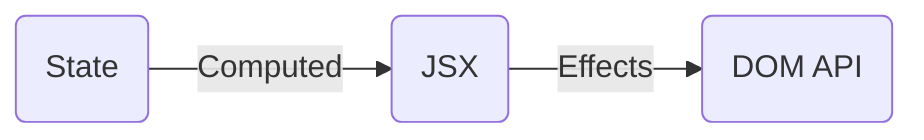
```mermaid
flowchart LR
  S(State) -->|Computed| V(JSX) -->|Effects| D(DOM API)
```

</div>
---
level: 2
---

# Примеры инкрементальных вычислений

- Mint - специальный язык для UI с компиляцией в JS
- Marko - расширение HTML для описания состояния
- "Реактивный CSS" - CSS Variables, пользовательские функции и properties
- Compose - компиляторный плагин для Kotlin, `@Composable`-функции
- QML - декларативный язык разметки UI в Qt


---
level: 1
layout: center
---

# Заключение

---
level: 1
---

# Заключение

<v-clicks>

- UI-фреймворк - решение, способствующее улучшению DX при разработке UI
- UI-фреймворк создаёт свою абстракцию - ментальная модель UI:
  - Чистая функция с семантикой инкрементального исполнения - "fine-grained reactivity"
  - Декларативный DSL описания связей между данными, преобразований и привязки к представлению
  - Строгие ограничения для поддержания абстракции
- Многие фреймворки приходят к этой концепции:
  - Те же соглашения и ограничения 
  - Разделение "обычного" кода от нестандартного, "прикладного" от "системного"

</v-clicks>

---
level: 2
---

# Спасибо!

<div class="grid grid-cols-2 gap-4 items-center">
  <div>
    QR
  </div>
  <div class="flex gap-x-1 text-xl items-center"><div><b>Василий Алфертьев</b></div></div>
  <div class="flex gap-3 items-center">
    <p>https://github.com/alfertev2014/rwrtw</p>
  </div>
  <div>
    <p><logos-telegram style="display: inline; width: 32px; height: 32px" /> <b>Telegram</b>: <a href="https://t.me/alfertev2012">@alfertev2012</a></p>
    <p><logos-github-icon style="display: inline; width: 32px; height: 32px"/> <b>GitHub</b>: <a href="https://github.com/alfertev2014">@alfertev2014</a></p>
  </div>
</div>
